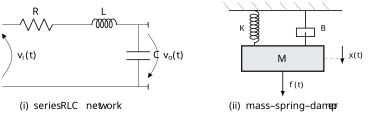

# Assignment 1 — Components, Devices and Modelling
**ASSIGNMENT 1**

/// admonition | Reading
    type: quote

**Issued** Week 1. **Due** at the start of the Week 3 lecture. **Weight** 1.5% of the unit. **Total** 40 marks.

**Covers** Week 1 (control system components and devices) and Week 2 (mathematical modelling of physical systems). Questions 3 and 4 use material from the Week 2 lecture and tutorial, so attempt them after that week.

**Submit** your own handwritten or typed solutions. Show your working — an unsupported final answer earns little credit, and a wrong answer with sound working earns most of it. This is individual work: you may discuss the questions with others, but what you hand in must be written by you.

**No software is required.** Everything here is to be done by hand.

///

## Question 1 — Anatomy of a real control system **\[10 marks\]** { #question-1-anatomy-of-a-real-control-system-10-marks }

A photovoltaic array is mounted on a single-axis tracker so that it can follow the sun through the day. A motor drives the array about a horizontal north–south axis; the array angle must match the sun’s elevation to within a degree or so if the energy gain over a fixed array is to be worth the cost of the mechanism.

1.  Draw a block diagram of the tracker as a closed-loop control system. Label the *plant*, *actuator*, *sensor*, *controller*, *reference*, *disturbance* and *measurement noise*, and state what physical quantity each signal on your diagram carries. **\[4 marks\]**

2.  Is this a *regulator* or a *tracking* system? Justify your answer in one or two sentences. **\[2 marks\]**

3.  Name one error detector and one actuator, chosen from the devices surveyed in Week 1, that would be suitable here. Give one reason for each choice. **\[2 marks\]**

4.  An engineer proposes to remove the sensor entirely and instead drive the array from a clock, using an astronomical almanac to compute where the sun ought to be. Give one substantial argument in favour of this open-loop scheme and one against. **\[2 marks\]**

## Question 2 — Devices **\[10 marks\]** { #question-2-devices-10-marks }

1.  Explain, in your own words and with a sketch, how a synchro transmitter and synchro control transformer are used together as an error detector. Your answer should make clear what the input and output of the pair are, and why the output is described as a *suppressed-carrier* signal. **\[5 marks\]**

2.  A three-stack variable-reluctance stepper motor has 15 teeth on each rotor.

    1.  Calculate the step angle. **\[1 marks\]**

    2.  How many pulses are required for one complete revolution of the rotor? **\[1 marks\]**

    3.  The motor is driven at 500 pulses per second. Find the shaft speed in revolutions per minute. **\[1 marks\]**

3.  A hydraulic linear actuator has transfer function $Y(s)/X(s)=K/[s(\tau s+1)]$, whereas a spring-loaded pneumatic diaphragm actuator has $\Delta Y(s)/\Delta P(s)=A/(Ms^{2}+fs+K)$. Explain the structural difference between the two — in particular, why one contains a free integrator and the other does not. **\[2 marks\]**

## Question 3 — Modelling two physical systems **\[10 marks\]** { #question-3-modelling-two-physical-systems-10-marks }

/// caption
**Figure 1.** image
///

1.  For the series $RLC$ network of figure (i), with input the source voltage $v_{i}(t)$ and output the capacitor voltage $v_{o}(t)$:

    1.  derive the governing differential equation from first principles;

    2.  hence obtain the transfer function $V_{o}(s)/V_{i}(s)$, assuming zero initial conditions;

    3.  write down the characteristic equation, and evaluate it for $R=4\,\Omega$, $L=1\,\mathrm{H}$, $C=0.125\,\mathrm{F}$.

    **\[5 marks\]**

2.  For the mass–spring–damper of figure (ii), with input the applied force $f(t)$ and output the displacement $x(t)$, obtain the differential equation, the transfer function $X(s)/F(s)$ and the characteristic equation. Evaluate for $M=1\,\mathrm{kg}$, $B=4\,\mathrm{N}\,\mathrm{s}\,\mathrm{m}^{-1}$, $K=8\,\mathrm{N}\,\mathrm{m}^{-1}$. **\[3 marks\]**

3.  Compare your two characteristic equations. What does the comparison tell you, and what does it *not* tell you? (Look also at the d.c. gain of each transfer function.) **\[2 marks\]**

## Question 4 — The armature-controlled d.c. servomotor **\[10 marks\]** { #question-4-the-armature-controlled-d.c.-servomotor-10-marks }

An armature-controlled d.c. servomotor has armature resistance $R_{a}$ and inductance $L_{a}$, torque constant $K_{t}$ and back-emf constant $K_{b}$. Its rotor has moment of inertia $J_{m}$ and viscous friction coefficient $b$. The input is the armature voltage $v_{a}(t)$; the field is separately excited and held constant.

1.  Write down the armature circuit equation and the mechanical (torque balance) equation. Define every symbol you use, and state clearly the two assumptions that make this a *linear* model. **\[3 marks\]**

2.  Eliminating the armature current, derive the transfer function $\theta_{m}(s)/V_{a}(s)$. **\[3 marks\]**

3.  Show that when the armature inductance is negligible, $L_{a}\to 0$, the result takes the form 

$$\frac{\theta_{m}(s)}{V_{a}(s)}=\frac{K_{m}}{s(\tau_{m}s+1)},$$

 and give $K_{m}$ and $\tau_{m}$ in terms of the motor parameters. Evaluate both for $R_{a}=2\,\Omega$, $K_{t}=0.5\,\mathrm{N}\,\mathrm{m}\,\mathrm{A}^{-1}$, $K_{b}=0.5\,\mathrm{V}\,\mathrm{s}\,\mathrm{rad}^{-1}$, $J_{m}=0.02\,\mathrm{kg}\,\mathrm{m}^{2}$ and $b=0.01\,\mathrm{N}\,\mathrm{m}\,\mathrm{s}\,\mathrm{rad}^{-1}$. **\[2 marks\]**

4.  The motor now drives a load of inertia $J_{L}=1.5\,\mathrm{kg}\,\mathrm{m}^{2}$ through a gear train of ratio $n=\theta_{L}/\theta_{m}=1/10$. Explain how the load inertia appears at the motor shaft, recompute $\tau_{m}$, and comment on the result. Load friction may be neglected. **\[2 marks\]**

------------------------------------------------------------------------

 

End of Assignment 1. Total 40 marks. 
Due at the start of the Week 3 lecture.
