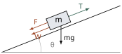
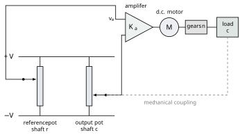
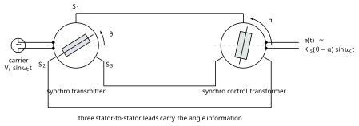
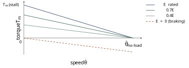
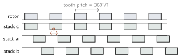
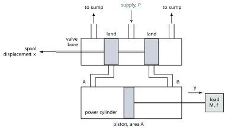
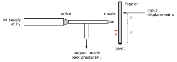
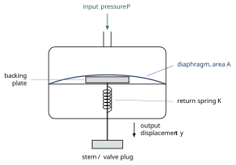

# Week 1 — Introduction and Control System Components
## What this week covers { #what-this-week-covers }

/// admonition | By the end of this week you should be able to
    type: abstract

-   Name the six parts of a feedback control system — plant, actuator, sensor, controller, reference and disturbance — on a block diagram of a real system, and say what signal each one carries.

-   Classify a given system as open-loop or closed-loop, and justify the classification from what the system does, not from how it is drawn.

-   Show quantitatively, on the cruise-control example, why feedback reduces steady-state error and why it reduces sensitivity to an unknown plant parameter.

-   Define a servomechanism and identify one in a schematic.

-   Describe the working principle of the standard control components: potentiometer and synchro error detectors, d.c. and a.c. servomotors, stepper motors, tachogenerators, hydraulic pumps, motors, valves and cylinders, and pneumatic bellows, flapper valves, relays and actuators.

-   Recognise the transfer function $K/[s(\tau s+1)]$ as the shape shared by almost every positional actuator you will meet, and say where the integrator comes from.

///

/// admonition | Reading
    type: quote

**Primary** — Khalil, Ch. 1 (pp. 1–8). Appendix A, Laplace review (p. 438), for the tutorial hour. 
**Secondary** — Nise (6th ed.), §1.1–1.4 (pp. 2–14); §1.5 The Design Process (p. 15); §2.2 Laplace review (p. 35). 
**Components (essential this week)** — Nagrath & Gopal (2nd ed.), §4.3 Electrical Systems (pp. 84–99): a.c. servomotors p. 84, a.c. tachometer p. 88, amplidyne p. 90, synchros p. 92, a.c. position control system p. 96. §4.4 Stepper Motor (pp. 99–104). §4.5 Hydraulic Systems (pp. 104–116): pumps and motors p. 104, valves p. 108, linear actuator p. 110. §4.6 Pneumatic Systems (pp. 116–121): bellows p. 116, flapper valve p. 117, relay p. 118, actuator p. 119. 
**Further** — Sundararajan, §1.1–1.3. Nagrath §5.4 (p. 137, Fig. 5.6 on p. 138) for the potentiometer position servomechanism of Figure [5](#fig:servo).

///

*Contact hours this week:* 2 h lecture $+$ 1 h tutorial. 
*Syllabus items addressed:* “Introduction: Examples of control systems. Open and closed-loop classification. Control systems components and devices. Servomechanism, Stepper motors, Hydraulic systems, Pneumatic systems, Valves, cylinders, and rotary actuators.” 
*Expected learning outcome:* ELO 1 — *describe the working principles of a given control system.*

**A note on the two halves.** The first lecture hour is about ideas and has almost no hardware in it. The second hour is about hardware and has almost no mathematics in it. Do not be misled by the second hour into thinking this unit is a catalogue of devices: it is not. The components are here so that when a block in a diagram is labelled “actuator” for the next eleven weeks, you know what is physically inside it.

## Part A — What control engineering is { #partmarker-part-a-what-control-engineering-is }

### 1. The problem control engineering solves

What do rockets, aircraft, cars, robots, power grids, electric drives, manufacturing lines, disc drives and artificial pancreas systems have in common? Every one of them contains at least one *automatic control system*: an arrangement that makes some variable behave in a desired way *without a human operator intervening moment by moment* (Khalil, p. 2).

Some concrete instances of “behave in a desired way”:

-   hold a car at a set speed, or keep it inside a lane;

-   hold a room at a set temperature;

-   make the position or velocity of a motor follow a prescribed pattern;

-   hold the frequency of a power grid at 50 Hz;

-   make a rocket follow a desired trajectory.

Each of these has the same skeleton. There is a physical thing whose behaviour we care about. It has variables we can *measure* (outputs) and variables that *drive* it (inputs). Some of the inputs we can set; the rest happen to us.

/// admonition | Key idea
    type: info

A control problem exists whenever you can measure something, you can push on something, and there is a gap between what the thing is doing and what you want it to do.

///

#### 1.1. The vocabulary, fixed now for twelve weeks

The terms below are used in exactly this sense for the rest of FEE3411 and for FEE3412. Learn them this week; after this they are assumed.

| **Term**                                       | **Meaning**                                                                                                                                                          |
|:-----------------------------------------------|:---------------------------------------------------------------------------------------------------------------------------------------------------------------------|
| Plant (or process)                             | The system whose output is to be controlled. Its inputs are the control signal and the disturbance; its output is the controlled variable.                           |
| Controlled variable (output)                   | The variable we want to behave in a desired way, e.g. vehicle speed, antenna angle, tank level.                                                                      |
| Reference (command, set point, desired output) | The value we want the controlled variable to take.                                                                                                                   |
| Control input                                  | An input we *can* manipulate: throttle angle, armature voltage, valve opening.                                                                                       |
| Disturbance input                              | An input that affects the plant but which we *cannot* manipulate: road gradient, wind load, a change in load torque.                                                 |
| Actuator                                       | The device that converts the controller’s (usually low-power) command into the physical quantity that acts on the plant: engine, motor, hydraulic ram.               |
| Sensor (output transducer)                     | The device that measures the controlled variable and converts it into the form the controller uses.                                                                  |
| Measurement (sensor) noise                     | The difference between what the sensor reports and what is actually there. No sensor is exact.                                                                       |
| Controller                                     | The device that computes the control input from the reference and the measurement.                                                                                   |
| Error                                          | Reference minus controlled variable. Strictly, this name is only exact when the input and output transducers both have unit gain — see the pitfall in §[2](#sec:oc). |

/// admonition | Common pitfall
    type: warning

“Input” is ambiguous in ordinary speech and precise here. The *input to the system* is the reference $r(t)$ — what you ask for. The *input to the plant* is the control signal $u(t)$ — what the actuator delivers. They are different signals at different points of the diagram, and confusing them is the single most common cause of a wrong block-diagram reduction in Week 4.

///

Throughout this unit we restrict attention to systems with one control input and one measured output — *single-input–single-output* (SISO) systems. Real plants often have several of each; the multivariable case needs the state-space methods that sit outside this syllabus.

### 2. Open-loop and closed-loop control { #sec:oc }

There are exactly two architectures, and the whole of classical control is about the second one.

###### Open-loop control.

A model of the plant is used to work out, in advance, what control input ought to produce the desired output. That input is applied. Nothing is measured, so nothing is corrected (Khalil, p. 2; Nise §1.3, p. 7).

###### Closed-loop (feedback) control.

The output is measured, fed back, and compared with the reference. The control input is then computed from the difference, in a direction that drives the output towards the reference.

<figure id="fig:openclosed">

<figcaption><strong>Figure 1.</strong> The two configurations. In (a) a disturbance \(d\) passes straight through to the output and is never corrected. In (b) its effect appears in the measurement, hence in the error \(e\), and the controller acts on it. The price is the sensor, its cost, and its noise \(n\). Cf. Nise Fig. 1.6, p. 8.</figcaption>
</figure>

/// admonition | Key idea
    type: info

The distinguishing feature of an open-loop system is that it cannot compensate for a disturbance. A closed-loop system corrects for disturbances *it can see in the measurement* — and only for those.

///

Nise’s example is a toaster: its output is the colour of the toast, but it measures time, not colour, so it cannot know that the bread is rye rather than white, or thick rather than thin. Anyone who has burnt toast has performed the experiment. A toaster *oven* that measures reflectivity and humidity is closed-loop — and is several times the price. That trade-off is real and is made on every project.

#### 2.1. Worked example: cruise control

This example carries most of the intellectual content of the week. It is worth following every line.

{#fig:car}
/// caption
**Figure 2.** Forces on a vehicle on a road of slope $\theta$. Cf. Khalil Fig. 1-1, p. 3.
///

/// admonition | Worked example 2.1 — open- versus closed-loop cruise control
    type: example

**Model.** With $T=au$ the thrust from throttle angle $u$ and engine gain $a$, $F=b\upsilon$ the road friction, and $W=mg\sin\theta+D$ a disturbance made of the gradient term and aerodynamic drag, Newton’s second law along the road gives 

$$m\dot{\upsilon}=T-F-W=au-b\upsilon-mg\sin\theta-D .$$

 Here $u$ is the control input, $\upsilon$ is the controlled output. Only the engine gain $a$ is known reliably: the mass $m$ depends on how many passengers are aboard, $b$ on the road surface, and $W$ on gradient and wind.

**Open-loop design.** Design as if there were no disturbance, $W=0$, using nominal values $\hat m$ and $\hat b$: 

$$\hat m \dot\upsilon = au-\hat b \upsilon .$$

 At steady state $\dot\upsilon=0$, so $\upsilon_{ss}=au/\hat b$. To make $\upsilon_{ss}$ equal the desired speed $\upsilon_{des}$, choose the constant throttle 

$$\boxed{\;u=\frac{\hat b\,\upsilon_{des}}{a}\;}$$

 Now apply that fixed $u$ to the *real* car, which has the true $b$, the true $m$, and a real disturbance $W$: 

$$m\dot\upsilon = \hat b \upsilon_{des}-b\upsilon-W
  \quad\Longrightarrow\quad
  \upsilon_{ss}=\frac{\hat b\upsilon_{des}-W}{b},$$

 so the steady-state speed error is 

$$\upsilon_{des}-\upsilon_{ss}
  =\left(\frac{b-\hat b}{b}\right)\upsilon_{des}+\frac{1}{b}W .
  \tag{1}$$

**Closed-loop design.** Measure $\upsilon$ with a speedometer and set 

$$u=\underbrace{\frac{\hat b\,\upsilon_{des}}{a}}_{\text{feedforward}}
   +\underbrace{K(\upsilon_{des}-\upsilon)}_{\text{feedback}} .
  \tag{2}$$

 Substituting into the true model, 

$$m\dot\upsilon=\hat b\upsilon_{des}+aK(\upsilon_{des}-\upsilon)-b\upsilon-W
   =-(b+aK)\upsilon+(\hat b+aK)\upsilon_{des}-W,$$

 and the steady-state error becomes 

$$\upsilon_{des}-\upsilon_{ss}
  =\left(\frac{b-\hat b}{b+aK}\right)\upsilon_{des}+\frac{1}{b+aK}W .
  \tag{3}$$

**What it means.** Compare [(1)](#eq:ol) and [(3)](#eq:cl). They are the same expression with $b$ replaced by $b+aK$ in *both* denominators. Making the feedback gain $K$ large therefore shrinks *both* error terms at once: the term caused by not knowing $b$, and the term caused by the disturbance $W$. One knob buys robustness to parameter error and rejection of disturbance together. That is what feedback is for.

///

{#fig:cruise}
/// caption
**Figure 3.** The cruise-control loop of Worked example 2.1, showing the four basic components: plant, actuator, sensor, controller. Cf. Khalil Fig. 1-2, p. 5.
///

#### 2.2. Why not simply make *K* enormous?

Equation [(3)](#eq:cl) suggests taking $K\to\infty$. Three things stop you, and between them they account for most of the remaining eleven weeks (Khalil, p. 5):

1.  **The actuator saturates.** A throttle angle has a maximum. Beyond it, extra commanded control does nothing. *(Control constraints — background only in this unit; examinable in FEE3412.)*

2.  **Transient response degrades.** A large $K$ makes the response faster but more oscillatory, and the design specification usually limits overshoot. *(Weeks 5, 8, 9.)*

3.  **The system can become unstable.** Above some gain the closed loop no longer settles at all. This does not happen in the first-order cruise model above, but it is the norm once the plant has any real dynamics. *(Weeks 7, 8, 10, 11, 12 — this is the largest single theme of the unit.)*

If you have ever heard a public-address system squeal when the volume is turned up, you have heard instability caused by high-gain feedback.

/// admonition | Common pitfall
    type: warning

Feedback is not free and it is not always better. It adds a sensor (cost, noise, one more thing to fail) and it can destabilise a plant that was perfectly well behaved open loop. “Closed loop is better” is not a theorem; it is a trade-off, and the rest of this unit is the machinery for making the trade deliberately.

///

#### 2.3. Error versus actuating signal

In Figure [1](#fig:openclosed)(b) the signal leaving the first summing junction is properly called the *actuating signal*. It equals the true error $r-y$ only when the input and output transducers both have gain 1. A position loop whose feedback potentiometer produces 0.5 V rad^−1^ while the reference potentiometer produces 1 V rad^−1^ has an actuating signal that is *not* proportional to $r-y$, and computing steady-state error as though it were will give the wrong answer. We return to this properly in Week 6 under *non-unity feedback*.

### 3. What a well-designed control system must do { #sec:objectives }

Khalil (p. 6) lists six requirements. They are worth copying out, because they are, almost exactly, the syllabus of this unit and the next.

| **Requirement**                                                                      | **Where it is dealt with**                                                                        |
|:-------------------------------------------------------------------------------------|:--------------------------------------------------------------------------------------------------|
| The system must be **stable**: a well-behaved input must give a well-behaved output. | Weeks 7 (Routh–Hurwitz), 8 (root locus), 11–12 (Nyquist).                                         |
| The output must **track** the reference with zero or small **steady-state error**.   | Week 6 (static error constants, system type).                                                     |
| The **transient response** must be acceptable.                                       | Weeks 5 (specifications), 8–9 (shaping it by gain).                                               |
| The effect of **disturbance** and **measurement noise** should be small.             | Background reading only in FEE3411 (Khalil §4-4 to §4-8; Nise §7.5, §7.7). Examinable in FEE3412. |
| The design must be **robust** to model uncertainty.                                  | Introduced through gain and phase margins, Weeks 10 and 12. Treated properly in FEE3412.          |
| The design must respect **constraints** on the control input.                        | Background only here; FEE3412.                                                                    |

/// admonition | Key idea
    type: info

Stability, steady-state accuracy and transient response are the three things FEE3411 teaches you to *analyse*. FEE3412 teaches you to *design* for them. If you can say which of the three a question is about, you can usually say which method it wants.

///

#### 3.1. Where the mathematics comes from

Every method in this unit needs a mathematical model of the plant. Models come from (Khalil, p. 6):

-   **first principles** — Kirchhoff’s laws, Newton’s laws, energy balances. This is Week 2.

-   **identification experiments** — apply known inputs, measure the outputs, fit a model to the data. Outside this syllabus, but note that fitting a second-order model to a measured step response, which you do in the Week 5 tutorial, is identification in miniature.

-   **both** — derive the structure from physics, then measure the parameters.

A model that captures everything is too complicated to design with. A model that captures too little gives a design that fails on the real plant. Choosing what to leave out is the hardest judgement in the subject and it requires understanding the physics, not just the algebra.

#### 3.2. The design process as a map of the course

Nise (§1.5, p. 15, Fig. 1.11) sets out six steps. They are reproduced in Figure [4](#fig:design) with the week of this unit that covers each. Use it as a map: when a topic feels disconnected, find it here.

{#fig:design}
/// caption
**Figure 4.** The design process; cf. Nise Fig. 1.11, p. 15, annotated with the week of FEE3411 in which each step is taught. Steps 1 and 2 are this week.
///

### 4. The servomechanism { #sec:servo }

/// admonition | Key idea
    type: info

A **servomechanism** (servo) is a feedback control system in which the controlled variable is a mechanical position, or one of its derivatives (velocity, acceleration).

///

The servomechanism deserves its own name because it is the archetype: antenna pointing, machine-tool slides, robot joints, radar dishes, aircraft control surfaces, disc-drive head positioning, steering gear on ships. Almost every worked example in this unit is, underneath, a servo.

Figure [5](#fig:servo) shows the standard laboratory form. A pair of potentiometers acts as the error detector: one is turned by the reference shaft, the other by the load shaft, and both are fed from the same d.c. supply. The voltage between the two wipers is 

$$v_e = K_p\,(r-c),
  \tag{4}$$

 where $r$ and $c$ are the reference and output shaft angles in radians and $K_p$ is the potentiometer sensitivity in V rad^−1^. The subtraction is done by the wiring, not by a circuit: this is the physical realisation of the summing junction drawn as $\otimes$ in Figure [1](#fig:openclosed). The error voltage is amplified by $K_a$ and drives the armature of a d.c. motor, which turns the load through a gear train of ratio $n$ in the direction that reduces the error.

{#fig:servo}
/// caption
**Figure 5.** Position servomechanism with a potentiometer-pair error detector. The two wipers are the summing junction: the voltage between them is $K_p(r-c)$. Cf. Nagrath & Gopal (2nd ed.) §5.4, p. 137, whose Fig. 5.6 (p. 138) is this schematic with its block diagram; we derive that block diagram in Week 4 and its response in Week 5.
///

###### Regulator or tracking system?

Two duties are worth distinguishing, because they lead to different specifications:

-   a **regulator** holds the output at a constant reference in the face of disturbances — speed governor, voltage regulator, temperature control;

-   a **tracking (follow-up) system** makes the output follow a reference that is itself changing — a radar dish following an aircraft, a machine-tool axis following a profile.

The same hardware often does both. The distinction matters in Week 6, where the steady-state error depends on whether the reference is a step, a ramp or a parabola.

## Part B — Control system components and devices { #partmarker-part-b-control-system-components-and-devices }

This half of the lecture is a *survey*. The syllabus outcome is ELO 1, “describe the working principles”, and that is the depth expected: you should be able to say what a device does, how it does it, and roughly what its transfer function looks like. Deriving those transfer functions is Week 2 and, in more detail, FEE3412, which contains a full hardware block.

{#fig:chain}
/// caption
**Figure 6.** Where each family of components sits in the loop. Everything in Part B is one of these four boxes.
///

### 5. Error detectors

The error detector performs the subtraction $r-c$ physically. Two standard devices do it for angular position.

#### 5.1. The potentiometer pair

Described in §[4](#sec:servo) and Figure [5](#fig:servo). Its virtues are that it is cheap, it is a d.c. device (the output is a d.c. voltage proportional to the error), and its model, equation [(4)](#eq:pot), is a pure gain $K_p$ with no dynamics. Its vices are wiper friction, finite resolution set by the winding pitch, wear, and electrical noise from the sliding contact.

#### 5.2. The synchro pair

For anything that must run continuously, or turn through many revolutions, or survive a hostile environment, the sliding contact is unacceptable. The *synchro* (trade names *selsyn*, *autosyn*) replaces it with transformer action. Nagrath §4.3, p. 92.

A **synchro transmitter** is built like a small three-phase alternator. The stator carries three identical Y-connected coils with their axes 120 ° apart; the rotor carries a single concentric coil fed with a.c. through slip rings. Applying $v(t)=V_r\sin\omega_c t$ to the rotor sets up a sinusoidally distributed air-gap flux along the rotor axis. By transformer action a voltage is induced in each stator coil, proportional to the cosine of the angle between that coil’s axis and the rotor axis. With the rotor at angle $\theta$ from the axis of coil $S_2$, the coil-to-neutral voltages are 

$$v_{s_1n}=KV_r\sin\omega_c t\,\cos(\theta+120^\circ),\quad
  v_{s_2n}=KV_r\sin\omega_c t\,\cos\theta,\quad
  v_{s_3n}=KV_r\sin\omega_c t\,\cos(\theta+240^\circ).$$

/// admonition | Key idea
    type: info

The synchro transmitter is a single-phase transformer whose rotor coil is the primary and whose three stator coils are the secondaries. Its input is a shaft angle; its output is three a.c. voltages whose magnitudes encode that angle.

///

The three stator terminals are wired to the stator of a **synchro control transformer**, which is built the same way except that its rotor is cylindrical, so the air gap — and hence the rotor output impedance — does not change as it turns. Circulating currents reproduce in the control transformer’s air gap the same flux pattern the transmitter had, so the voltage induced in the control transformer rotor is proportional to the cosine of the angle between the two rotors: 

$$e(t)=K'V_r\cos\phi\,\sin\omega_c t .$$

 With the rotors displaced by $\theta$ and $\alpha$ from their respective electrical zeros, $\phi=90^\circ-\theta+\alpha$ and 

$$e(t)=K'V_r\sin(\theta-\alpha)\sin\omega_c t
      \;\approx\; K_s(\theta-\alpha)\sin\omega_c t
      \quad\text{for small }(\theta-\alpha),
  \tag{5}$$

 where $K_s$ is the **sensitivity of the error detector** in V rad^−1^ (rms per radian of shaft difference).

{#fig:synchro}
/// caption
**Figure 7.** Synchro transmitter and control transformer used as an error detector. Cf. Nagrath & Gopal Fig. 4.12, p. 94. The three stator-to-stator leads carry the angle information; there is no sliding contact in the signal path.
///

The output in [(5)](#eq:synchro) is a carrier $\sin\omega_c t$ whose *amplitude* carries the error, and whose *phase reverses* when the error changes sign. This is **suppressed-carrier modulation**. A control system whose internal signals are of this form is called a **carrier control system**, and it is analysed on the basis of the modulating signal alone, which is valid provided the signal bandwidth is much lower than the carrier frequency.

/// admonition | Common pitfall
    type: warning

In a carrier system the useful information is the *envelope*, not the instantaneous value. A student who tries to read the error off an oscilloscope trace of $e(t)$ directly, instead of its envelope, will conclude the error is oscillating at 400 Hz when the shaft is standing still.

///

### 6. Electric actuators

#### 6.1. The d.c. servomotor

The workhorse. A d.c. motor becomes a servomotor when it is built for low inertia and rapid reversal. Two ways of controlling it:

-   **Armature control** — field current held constant, armature voltage varied. The one used almost universally, and the one whose transfer function we derive from first principles in the Week 2 tutorial.

-   **Field control** — armature current held constant, field voltage varied. Cheaper amplifier (the field carries less current) but slower, because the field circuit has a large inductance.

The armature-controlled motor driving inertia $J$ and viscous friction $f$ has the transfer function 

$$\frac{\theta_m(s)}{V_a(s)}=\frac{K_m}{s(\tau_m s+1)} .
  \tag{6}$$

 Note the shape — an integrator in series with a first-order lag. Keep it in mind; §[10](#sec:shape) is about why it keeps recurring.

Large d.c. systems historically used an **amplidyne** — a rotating power amplifier. It is a cross-field d.c. machine carrying two brush sets 90 ° apart; the quadrature-axis brushes are short-circuited through a series quadrature winding, so the machine delivers two stages of power amplification in one frame (Nagrath §4.3, p. 90). It has been displaced by thyristor and IGBT drives, but it appears in older textbook problems and you should recognise the name.

#### 6.2. The a.c. (two-phase) servomotor

Preferred at low power, and where a synchro error detector already makes the signals a.c. It is rugged, light, and has no brushes. Nagrath §4.3, p. 84.

Structurally it is a two-phase induction motor: two stator windings 90 ° apart in space, excited by voltages 90 ° apart in time. That produces a rotating field of constant magnitude; the field induces currents in the short-circuited rotor and the interaction produces torque in the direction of field rotation. Two design changes make it a servomotor:

1.  **High rotor resistance**, so that the ratio $X/R$ is small. In an ordinary induction motor $X/R$ is deliberately large, which puts maximum torque near the operating point and makes the torque–speed curve highly nonlinear — and, over part of its range, *positively* sloped. A positive slope means negative effective damping, which can make the closed loop unstable. This is precisely why an ordinary induction motor cannot be used as a servomotor.

2.  **Unbalanced excitation.** One winding, the *reference phase*, is fed with a fixed voltage. The other, the *control phase*, is fed from the servo amplifier with a variable-magnitude voltage at $\pm90{}^{\circ}$ to the reference. Reversing the sign of the control voltage reverses the direction of rotation. The rotor is a small-diameter squirrel cage or a drag cup, to keep inertia low.

{#fig:acservo}
/// caption
**Figure 8.** Torque–speed characteristics of a two-phase servomotor at several control-phase voltages, idealised as the straight lines used for linearisation. All slopes are negative — that is the whole point of the high-resistance rotor. At zero control voltage the motor develops a *decelerating* torque, so that line passes through the origin with negative slope. Cf. Nagrath & Gopal Fig. 4.6, p. 86.
///

Torque depends on both speed and control voltage, $T_m=f(\dot\theta,E)$. Expanding in a Taylor series about an operating point and keeping first-order terms (the linearisation technique of Week 2), 

$$\Delta T_m = K\,\Delta E - f\,\Delta\dot\theta,
  \qquad
  K=\left.\frac{\partial T_m}{\partial E}\right|_0,\quad
  f=-\left.\frac{\partial T_m}{\partial \dot\theta}\right|_0 .$$

 With a load of inertia $J$ and friction $f_0$, $\;\Delta T_m=J\Delta\ddot\theta
+f_0\Delta\dot\theta$, and taking Laplace transforms, 

$$G_m(s)=\frac{\Delta\theta(s)}{\Delta E(s)}
        =\frac{K}{Js^2+(f_0+f)s}
        =\frac{K_m}{s(\tau_m s+1)},
  \qquad K_m=\frac{K}{f_0+f},\quad \tau_m=\frac{J}{f_0+f}.
  \tag{7}$$

/// admonition | Key idea
    type: info

The negative slope of the torque–speed characteristic acts as extra viscous friction $f$, added to the load’s own $f_0$. If the slope were positive, $f_0+f$ could go negative — negative damping — and the system would be unstable. Stability considerations reach right down into the choice of rotor resistance.

///

The two constants are obtained from two standard tests: the **stall torque** test (rotor held, rated control voltage) and the **no-load speed** test. The straight line joining those two points is the working approximation to the characteristic, so 

$$K\approx\frac{\text{stall torque at rated voltage}}
                {\text{rated control-phase voltage}},
  \qquad
  f\approx\frac{\text{stall torque at rated voltage}}
                {\text{no-load speed at rated voltage}} .$$

 Nagrath notes (§4.3, eq. 4.7, p. 88) that in real servomotors the slope at low speed is nearer *half* the slope at rated voltage, so for position control work $f$ is often taken as half the value above.

#### 6.3. The stepper motor

A **stepper motor** converts a train of input pulses into a train of discrete angular steps, one step per pulse. It is the actuator of incremental motion control: printers, tape and capstan drives, machine tools, plotters, 3-D printers. Nagrath §4.4, p. 99.

The common types are *variable reluctance* and *permanent magnet*. In a variable-reluctance stepper the stator stacks are pulse-excited and the rotors are unexcited; both are toothed. When a stator stack is energised the rotor is pulled to the nearest **minimum-reluctance** position, where the teeth line up. That aligned position is stable; the position where rotor teeth face stator slots is unstable.

While the teeth on all rotors are aligned with each other, the stator teeth of successive stacks are offset by 

$$\alpha=\frac{360^\circ}{n\,T},
  \tag{8}$$

 where $n$ is the number of stacks (equal to the number of phases) and $T$ the number of rotor teeth. That angle $\alpha$ is the **step angle**. For $n=3$ stacks and $T=12$ teeth, $\alpha=10{}^{\circ}$. Exciting the phases in the order $abcabc\ldots$ steps the rotor one way; $bacbac\ldots$ steps it the other. *Directional control requires three or more phases* — with two, the sequence is the same read forwards or backwards.

{#fig:stepper}
/// caption
**Figure 9.** Developed (rolled-out) view of a three-stack variable-reluctance stepper. Rotor teeth are aligned across all stacks; stator stacks are offset successively by $\alpha=360^\circ/nT$. Energising $c$, then $a$, then $b$ pulls the rotor one step $\alpha$ at a time. Cf. Nagrath & Gopal Figs. 4.18 and 4.20, pp. 100–101.
///

Two consequences matter for control:

-   **The stepper is a digital actuator**, so shaft position is determined entirely by the pulse count. An *open-loop* step servo can therefore reach the accuracy of a closed-loop analogue system, with no position sensor at all. This is the rare case where open loop is the right engineering answer.

-   **The price of that is skipped steps.** If pulses arrive faster than the rotor can settle, or if the rotor oscillates too much about the lock position, a step is lost — and, since nothing is measured, lost silently and permanently. High-performance systems therefore close the loop after all, gating the pulse train from a position feedback signal.

The dynamic model is genuinely nonlinear. With inductance varying cosinusoidally with rotor angle, $L(\theta)=L_1+L_2\cos T\theta$, the reluctance torque is 

$$T_m=\tfrac{1}{2}i^2\frac{\partial L}{\partial\theta}=-K\,i^2(t)\sin T\theta ,$$

 which no linear approximation captures usefully. Stepper dynamics are solved numerically, not analytically — one reason steppers do not appear in the analysis weeks of this unit.

### 7. Sensors: the tachogenerator

A **tachogenerator** (tachometer) produces a voltage proportional to shaft speed: 

$$v_t = K_t\,\dot\theta ,\qquad [K_t]=\mathrm{V}\,\mathrm{rad}^{-1}\,\mathrm{s}^{-1}.
  \tag{9}$$

-   A **d.c. tachogenerator** is a small permanent-magnet d.c. generator. Output polarity follows the direction of rotation. Ripple from commutation is its main limitation.

-   An **a.c. (drag-cup) tachogenerator** has two stator coils in space quadrature and a thin aluminium cup for a rotor, rotating in the air gap of a fixed magnetic structure (Nagrath §4.3, p. 88). The reference coil is excited; rotation induces speed voltages in the cup, whose currents set up a quadrature flux, and the emf induced in the quadrature coil is proportional to speed. The very low rotor inertia is its advantage.

Tachogenerators are used in two distinct ways, and it is worth separating them now:

1.  as the **sensor of a speed control loop**, where speed is the controlled variable;

2.  as **rate feedback** inside a *position* loop, where the tachometer signal is subtracted in an inner loop to add damping.

The second is the more interesting. Nagrath’s a.c. position control system (§4.3, p. 96; Fig. 4.14, p. 97) uses a synchro pair, an a.c. amplifier, an a.c. servomotor, gearing, *and* an a.c. tachometer for rate feedback, giving the closed-loop transfer function 

$$\frac{\theta_c(s)}{\theta_r(s)}
   =\frac{K_mK_aK_s\,n}{\tau_m s^2+(1+K_mK_aK_t)s+K_mK_aK_s n},$$

 in which the tachometer constant $K_t$ appears only in the $s$ coefficient — the damping term. Adding rate feedback improves damping without changing the steady-state gain. That is your first sight of a compensator, and it is the reason to notice it now: we will meet it as a design tool in Week 9 and study it properly in FEE3412.

### 8. Hydraulic power elements

Where the load is large, hydraulics win. A hydraulic motor is far smaller than an electric motor of the same power output, and hydraulic components are fast and rugged. Against that: leaks, sealing against contamination, noise, and sluggishness at low temperature as the oil thickens; and hydraulic lines are not as flexible as cables. Typical uses are power steering and brakes, ship steering gear, large machine tools, aircraft flight controls, and excavators. Nagrath §4.5, p. 104.

Hydraulic output devices split by the motion they produce:

-   **rotary output** — *hydraulic motors* (this is what the syllabus phrase “rotary actuators” refers to);

-   **translational output** — *hydraulic linear actuators*, i.e. cylinders and rams.

#### 8.1. Pump–motor transmission

The classical arrangement is a **variable-stroke pump** driving a **fixed-stroke motor**. Both are axial-piston machines: pistons in a rotating cylinder block bear on a wobble (swash) plate. With the wobble plate in the neutral position the pistons do not reciprocate and no oil is pumped. Tilt the plate through the *stroke angle* $x$ and each piston strokes once per revolution, delivering oil at a rate proportional to $x$. Reversing the tilt reverses the flow, and hence reverses the motor. Control is exercised by one mechanical variable: the stroke angle.

The model follows from a flow balance and a torque balance: 

$$\begin{aligned}
  q_p &= K_p x &&\text{(ideal pump flow, proportional to stroke angle)}\ 
  q_m &= K_m\dot\theta &&\text{(motor flow, proportional to motor speed)}\ 
  q_\ell &= K_\ell p &&\text{(leakage, proportional to pressure drop)}\ 
  q_c &= K_c\,\dot p &&\text{(compressibility flow)}\ 
  q_p &= q_m+q_\ell+q_c &&\text{(continuity)}\ 
  T_m &= K_T p = J\ddot\theta+f\dot\theta &&\text{(torque balance at the load)}
\end{aligned}$$

 Eliminating $p$ and neglecting compressibility ($K_c\ll K_m$) gives 

$$G(s)=\frac{\theta(s)}{X(s)}=\frac{K}{s(\tau s+1)} .
  \tag{10}$$

 The same shape as [(6)](#eq:dcm) and [(7)](#eq:acm).

#### 8.2. Valve control

Instead of varying the pump stroke, hold the supply pressure constant and throttle the flow with a **spool valve**. The moving part of a valve is far lighter than a pump’s stroke mechanism, so the time constants are much smaller and the system is much faster. The cost is that valve flow is genuinely nonlinear: flow through a sharp-edged orifice goes as $\sqrt{\Delta p}$, so the linear model 

$$q = K_1 x - K_2 p
  \tag{11}$$

 is a linearisation valid only for small spool displacements about neutral. (Week 2 shows the technique that produces $K_1$ and $K_2$.)

A **three-way** valve has supply, sump and one service port; a **four-way** valve has two service ports and can drive a double-acting cylinder in both directions, which is what Figure [10](#fig:spool) shows. When the spool is at neutral, $x=0$, all flow is blocked. Move it one way and the supply is connected to one side of the piston while the other side drains to sump; move it the other way and the connections swap.

{#fig:spool}
/// caption
**Figure 10.** Four-way spool valve controlling a double-acting power cylinder — a hydraulic linear actuator. Spool displacement $x$ admits high-pressure oil to one side of the piston and vents the other to sump; the differential pressure drives the load a distance $y$. Cf. Nagrath & Gopal Fig. 4.27, p. 111 (the section begins on p. 110).
///

#### 8.3. The linear actuator (cylinder)

Take Figure [10](#fig:spool) and write down three equations. The linearised valve relation [(11)](#eq:valve); continuity, with flow into the cylinder equal to swept volume rate, $q=A\dot y$; and the force balance on the load, driven by the differential pressure acting on the piston area $A$: 

$$Ap = M\ddot y + f\dot y .$$

 Eliminating $q$ and $p$: 

$$\frac{Y(s)}{X(s)}=\frac{K}{s(\tau s+1)},
  \qquad K=\frac{K_1}{A},\qquad \tau=\frac{MK_2}{A^2+K_2 f}\;\;\text{(approx.)}
  \tag{12}$$

 Again the same shape.

/// admonition | Common pitfall
    type: warning

Note where the $1/s$ comes from. It is *not* an approximation and it is not the motor’s inertia. Flow into a cylinder sets the piston’s *velocity*, so position is the integral of the input. Any actuator whose input commands a rate — valve opening $\to$ velocity, armature voltage $\to$ speed, pump stroke $\to$ motor speed — carries a free integrator when the output of interest is position. Recognising this saves you an algebra step in half the problems in this course.

///

### 9. Pneumatic power elements { #sec:pneu }

Pneumatic systems use air rather than oil. Air is non-inflammable, has negligible viscosity, and does not change viscosity with temperature the way hydraulic oil does. But air is compressible, so pneumatic systems have substantial compressibility flow and are characterised by **longer time delays** — the reason they dominate in *process* control, where plants are slow anyway, and are rare where speed matters. Nagrath §4.6, p. 116.

#### 9.1. Bellows

A hollow chamber with thin corrugated side walls and flat end faces. It behaves as a spring. Separating force $=(\Delta P)A$; restoring force $=K(\Delta x)$; so at equilibrium 

$$\frac{\Delta X(s)}{\Delta P(s)}=\frac{A}{K}.
  \tag{13}$$

 A pure gain: pressure in, displacement out.

#### 9.2. The flapper–nozzle valve

The key pneumatic sensing element. Air at constant supply pressure $P_s$ passes through a fixed *orifice* and out of a *nozzle*. A pivoted *flapper* sits in front of the nozzle at distance $e$. Move the flapper closer and the restriction increases, so the nozzle back pressure $P_b$ rises towards $P_s$; move it away and $P_b$ falls towards ambient.

{#fig:flapper}
/// caption
**Figure 11.** Flapper–nozzle valve. Small movements of the flapper produce large changes in back pressure — a high-gain displacement-to-pressure transducer. Cf. Nagrath & Gopal Fig. 4.34, p. 117.
///

The characteristic $P_b$ against $e$ is nonlinear, but has a steep linear region which is the operating region. There, 

$$\frac{\Delta P_b(s)}{\Delta X(s)}=\left(\frac{a}{a+b}\right)K,
  \qquad K<0,
  \tag{14}$$

 where $a$ and $b$ are the lever arms from the pivot to the nozzle and to the input point, so that $e=[a/(a+b)]x$. The gain is negative: closer flapper, higher pressure.

#### 9.3. The pneumatic relay

Keeping the flapper motion small enough to stay linear keeps the output pressure swing small too, so a pneumatic power amplifier — a **relay** — is put in cascade. A ball on the lower bellows surface seats either on its upper seat (closing the vent, so output pressure rises to supply) or on its lower seat (shutting off supply, so output falls to ambient). Moving the flapper *away* from the nozzle drops $P_b$, the bellows contracts, the ball moves up, the vent closes and the output pressure *rises*. The relay therefore inverts the sign as well as amplifying: 

$$\frac{\Delta P(s)}{\Delta X(s)}=\left(\frac{a}{a+b}\right)K,\qquad K>0 .
  \tag{15}$$

#### 9.4. The pneumatic (diaphragm) actuator

Most pneumatic control systems need translational output. A diaphragm of area $A$ is exposed to the controlled pressure and moves a stem against a spring of stiffness $K$, with the load contributing mass $M$ and friction $f$: 

$$A\,\Delta P = M\Delta\ddot y+f\Delta\dot y+K\Delta y$$

 

$$\Longrightarrow\quad
  \frac{\Delta Y(s)}{\Delta P(s)}=\frac{A}{Ms^2+fs+K}.
  \tag{16}$$

{#fig:pneuact}
/// caption
**Figure 12.** Pneumatic diaphragm actuator. Unlike the hydraulic cylinder, the spring gives it a definite equilibrium position for each pressure — so its transfer function [(16)](#eq:pneuact) is second order with *no* free integrator. Cf. Nagrath & Gopal Fig. 4.37, p. 119.
///

/// admonition | Common pitfall
    type: warning

Compare [(16)](#eq:pneuact) with [(12)](#eq:cyl). The hydraulic cylinder has a free $1/s$; the spring-loaded pneumatic actuator does not. The difference is the spring: with a spring present, a constant pressure gives a constant *position*; without one, a constant flow gives a constant *velocity*. Read the physics, not the picture.

///

#### 9.5. Comparison

|                      | **Electric**                | **Hydraulic**                                       | **Pneumatic**                       |
|:---------------------|:----------------------------|:----------------------------------------------------|:------------------------------------|
| Working medium       | electric current            | incompressible oil                                  | compressible air                    |
| Power/weight         | moderate                    | very high                                           | low                                 |
| Speed of response    | fast                        | fastest under load                                  | slow (compressibility)              |
| Stiffness under load | moderate                    | very high                                           | low                                 |
| Typical use          | instruments, servos, drives | machine tools, steering, aircraft controls, presses | process control valves              |
| Main drawback        | limited torque density      | leaks, sealing, contamination, noise                | long time delays, low stiffness     |
| Safety               | sparks                      | fire risk from oil mist                             | non-inflammable, intrinsically safe |

### 10. The shape that keeps recurring { #sec:shape }

Collect the transfer functions from Part B:

| **Device**                        | **Transfer function**               |    **Equation**     |
|:----------------------------------|:------------------------------------|:-------------------:|
| Armature-controlled d.c. motor    | $\theta/V_a = K_m/[s(\tau_m s+1)]$  |   [(6)](#eq:dcm)    |
| Two-phase a.c. servomotor         | $\theta/E = K_m/[s(\tau_m s+1)]$    |   [(7)](#eq:acm)    |
| Hydraulic pump–motor transmission | $\theta/X = K/[s(\tau s+1)]$        |   [(10)](#eq:hyd)   |
| Hydraulic linear actuator         | $Y/X = K/[s(\tau s+1)]$             |   [(12)](#eq:cyl)   |
| Potentiometer error detector      | $V_e/(r-c)=K_p$                     |   [(4)](#eq:pot)    |
| Synchro error detector            | $E/(\theta-\alpha)=K_s$             | [(5)](#eq:synchro)  |
| Tachogenerator                    | $V_t/\dot\theta = K_t$              |  [(9)](#eq:tacho)   |
| Pneumatic bellows                 | $\Delta X/\Delta P = A/K$           | [(13)](#eq:bellows) |
| Pneumatic diaphragm actuator      | $\Delta Y/\Delta P = A/(Ms^2+fs+K)$ | [(16)](#eq:pneuact) |

/// admonition | Key idea
    type: info

Almost every *positional actuator* in control engineering, whatever its physics, has the transfer function 

$$G(s)=\frac{K}{s(\tau s+1)} .$$

 The $1/s$ is there because the input commands a rate and the output of interest is the integral of that rate. The $1/(\tau s+1)$ is there because inertia and friction resist that rate. Sensors and error detectors, by contrast, are usually pure gains.

///

This is not a coincidence to be noted and forgotten. It is why the same handful of standard forms carry the whole unit:

-   Put $K/[s(\tau s+1)]$ in a unity-feedback loop and you get a *second-order system* — Week 5, and its $\zeta$ and $\omega_n$.

-   The free integrator makes the open loop *type 1*, so it tracks a step with zero steady-state error and a ramp with a finite one — Week 6.

-   Its pole–zero pattern (one pole at the origin, one on the negative real axis) gives the most common root locus you will ever sketch — Week 8.

-   Its Bode plot is the sum of a $-20\,\mathrm{dB}\mathrm{/decade}$ line and one corner — Week 10.

## Summary { #summary }

-   A control system makes a variable behave in a desired way without continuous human intervention. Its parts are plant, actuator, sensor, controller; its signals are reference, control input, disturbance, controlled output and measurement noise.

-   Open-loop control applies a precomputed input and measures nothing; closed-loop control measures the output and corrects. Only closed-loop control can reject a disturbance.

-   In the cruise-control example, feedback with gain $K$ replaces $b$ by $b+aK$ in the steady-state error, reducing both the parameter-error term and the disturbance term. See [(1)](#eq:ol) and [(3)](#eq:cl).

-   Gain cannot be raised without limit: actuators saturate, transient response degrades, and the loop may become unstable.

-   A servomechanism is a feedback system whose controlled variable is mechanical position or a derivative of it.

-   Error detectors: potentiometer pair (d.c., gain $K_p$, sliding contact) and synchro pair (a.c., gain $K_s$, no sliding contact, suppressed-carrier output).

-   Actuators: d.c. servomotor (armature or field control), two-phase a.c. servomotor (high rotor resistance for a negatively sloped, near-linear torque–speed curve), stepper motor (digital, step angle $360^\circ/nT$, usable open loop but can skip steps), hydraulic pump–motor and valve-plus-cylinder, pneumatic diaphragm actuator.

-   Sensors: tachogenerator, $v_t=K_t\dot\theta$, used both as the sensor of a speed loop and as rate feedback to add damping to a position loop.

-   Hydraulics give high power density and stiffness; pneumatics are safe and cheap but slow because air is compressible.

-   Positional actuators almost universally have the form $K/[s(\tau s+1)]$; error detectors and sensors are usually pure gains.

## Before the tutorial { #before-the-tutorial }

These are not the tutorial sheet. They are the minimum you should be able to do before you walk in. The tutorial hour itself is a review of the mathematical toolkit — Laplace transform pairs and properties, partial fractions, complex numbers and the $s$-plane, and the standard test signals — so revise Khalil Appendix A (p. 438) or Nise §2.2 (p. 35) beforehand.

1.  A domestic pressure cooker holds pressure with a weighted valve that lifts when the internal pressure exceeds a set value. Is this open-loop or closed-loop? Identify the plant, the controlled variable, the sensor, the actuator and the reference. What is the disturbance?

2.  In Worked example 2.1, suppose the engine gain is $a=20\,\mathrm{N}/{}^{\circ}$, the true friction coefficient is $b=50\,\mathrm{N}\,\mathrm{s}\,\mathrm{m}^{-1}$ while the nominal value used in design was $\hat b=45\,\mathrm{N}\,\mathrm{s}\,\mathrm{m}^{-1}$, the disturbance is $W=200\,\mathrm{N}$ and the desired speed is $\upsilon_{des}=25\,\mathrm{m}\,\mathrm{s}^{-1}$. Compute the steady-state speed error open loop from [(1)](#eq:ol), and closed loop from [(3)](#eq:cl) with $K=10$. By what factor does feedback improve it?

3.  A three-stack variable-reluctance stepper motor has 20 rotor teeth. What is its step angle? How many pulses are needed for one full revolution of the rotor? If the load must be positioned to 0.5 °, is this motor adequate on its own, and if not, name two ways to fix it.

4.  Write down, without deriving them, the transfer function of (a) an armature-controlled d.c. servomotor driving an inertial load, (b) a hydraulic valve-and-cylinder actuator, and (c) a spring-loaded pneumatic diaphragm actuator. Which one is the odd one out, and why?

5.  Sketch, from memory, the block diagram of Figure [1](#fig:openclosed)(b), labelling every signal and every block. You will draw this diagram more times in the next eleven weeks than any other.

## Looking ahead { #looking-ahead }

This week gave you the vocabulary and the hardware. Everything after it is mathematics applied to that vocabulary. **Week 2** derives models from first principles — electrical networks, translational and rotational mechanical systems — and in the tutorial builds the armature-controlled d.c. servomotor driving a load through a gear train, which is the transfer function [(6)](#eq:dcm) quoted here without proof. It also covers linear approximation to nonlinear systems, the technique used informally in §6 to linearise the a.c. servomotor’s torque–speed surface and the spool valve’s orifice flow. **Week 3** converts those models into transfer functions and moves into the $s$-plane; **Week 4** connects them into block diagrams and reduces them.

Two boundaries worth stating explicitly now. First, *components are survey depth in FEE3411*. You need to describe working principles (ELO 1); you are not expected to design a servomotor or select a valve. FEE3412 contains a full hardware block and treats these devices properly. Second, *FEE3411 owns analysis and FEE3412 owns design*. We will learn to predict what a system does and to say whether it is stable, accurate and fast enough. Choosing a compensator to *make* it stable, accurate and fast — lead, lag, lag-lead, PID synthesis — belongs to FEE3412. The one exception is a single hour in Week 9 on design specifications and gain adjustment, which is orientation, not synthesis. When you meet the phrase “design a compensator” in Khalil Ch. 5 or Nise Ch. 9 and 11, treat it as a forward reference: worth reading, not examinable here.

Finally, note that the disturbance $d$ and noise $n$ drawn in Figure [1](#fig:openclosed)(b) will mostly be set to zero for the rest of this unit. They are drawn because they are physically always present, and because their rejection is one of the six objectives in §[3](#sec:objectives). Their quantitative treatment (Khalil §4-4 to §4-8; Nise §7.5, §7.7) is background reading here and examinable in FEE3412.
