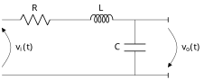
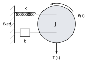
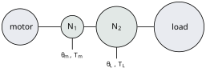
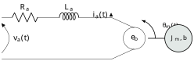
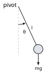

# Week 2 — Mathematical Modelling of Physical Systems
## What this week covers { #what-this-week-covers }

/// admonition | By the end of this week you should be able to
    type: abstract

-   State the standard differential-equation model of a linear, time-invariant, causal (LTI) system, and write down its characteristic equation directly from the equation of motion.

-   Derive the governing differential equation of an electrical network from Kirchhoff’s voltage law, and obtain its transfer function.

-   Derive the governing differential equation of a translational mechanical system from Newton’s second law, using a free-body diagram, and recognise the force–voltage analogy with an electrical network.

-   Derive the governing equation of a rotational mechanical system (moment of inertia, torsional spring, viscous friction) by the rotational analogue of Newton’s second law.

-   Explain how a gear train reflects torque, speed and moment of inertia from one shaft to another, and compute an equivalent inertia at a chosen shaft.

-   Derive the transfer function of an armature-controlled d.c. servomotor from first principles, with and without armature inductance, and combine it with a gear train driving a load.

-   Linearise a nonlinear differential equation about an operating point by a first-order Taylor expansion, and identify when the approximation is and is not valid.

///

/// admonition | Reading
    type: quote

**Primary** — Khalil, §2-1 (p. 10); §2-2.1 Electric Circuits (p. 14); §2-2.2 Mechanical Systems (p. 24); §2-2.3 Electromechanical Systems (p. 37); §2-4 Linearization (p. 50). 
**Secondary** — Nise (6th ed.), §2.4 Electrical Network Transfer Functions (p. 47); §2.5 Translational Mechanical System Transfer Functions (p. 61); §2.6 Rotational Mechanical System Transfer Functions (p. 69); §2.7 Transfer Functions for Systems with Gears (p. 74); §2.8 Electromechanical System Transfer Functions (p. 79); §2.10–2.11 Linearization (pp. 88–89). 
**Further** — Sundararajan, Ch. 3, Ch. 4, §6.4.

///

*Contact hours this week:* 2 h lecture $+$ 1 h tutorial. 
*Syllabus items addressed:* “Inputs, plant and outputs… Mathematical models. The characteristic equation. Linear approximation to nonlinear systems. Analysis of linear (causal) systems…” (Time Domain Linear Systems Analysis). 
*Expected learning outcomes:* ELO 1 — *describe the working principles of a given control system* (the servomotor, continued from Week 1); ELO 2 — *analyse a control system solution in the time- and frequency-domains* (begins properly this week).

**A note on the two halves.** The first lecture hour builds the general framework and applies it to electrical networks. The second hour applies the *same* framework to mechanical systems, to gears, and to the electromechanical system that combines both: the d.c. servomotor promised at the end of Week 1. The tutorial hour is where the servomotor and linearisation are drilled in worked problems; both are derived properly here so the notes remain self-contained.

## Part A — The modelling framework, and electrical networks { #partmarker-part-a-the-modelling-framework-and-electrical-networks }

### 1. From a physical system to a differential-equation model { #sec:framework }

Every method in FEE3411 — Routh–Hurwitz, root locus, Bode, Nyquist — is applied to a mathematical model, never to the physical system itself. This week is about how that model is obtained. Whatever the physics, a model of a single-input–single-output plant with input $u(t)$ and output $y(t)$ takes the same general shape (Khalil, p. 10): 

$$a_n\,y^{(n)}(t) + a_{n-1}\,y^{(n-1)}(t) + \cdots + a_1\,\dot y(t) + a_0\,y(t)
  = b_m\,u^{(m)}(t) + \cdots + b_1\,\dot u(t) + b_0\,u(t),
  \tag{1}$$

 a linear, constant-coefficient ordinary differential equation, where $y^{(k)}=d^k y/dt^k$. Three words describe it precisely, and each is doing real work:

-   **Linear** — superposition holds: the response to $\alpha u_1+\beta
          u_2$ is $\alpha y_1 + \beta y_2$. Every coefficient in [(1)](#eq:general-ode) multiplies $u$, $y$ or a derivative to the first power only; there is no $y^2$, no $u\dot y$, no $\sin y$.

-   **Time-invariant** — the coefficients $a_i,b_i$ do not themselves depend on $t$. Delaying the input by $t_0$ simply delays the output by $t_0$; the system does not care what time it is.

-   **Causal** — the output at time $t$ depends only on the input up to time $t$, never on the future. Every physical system is causal; it is listed as a property because *mathematical* operators that are not causal (a pure differentiator applied to noisy data, for instance) turn up in textbooks and cannot be built.

/// admonition | Key idea
    type: info

Setting the input to zero in [(1)](#eq:general-ode) and replacing each $y^{(k)}$ by $s^k$ gives the **characteristic equation** 

$$a_n s^n + a_{n-1}s^{n-1} + \cdots + a_1 s + a_0 = 0 .$$

 It depends only on the plant — never on the input, and never on where in the diagram you choose to call the output. Its roots govern every natural (unforced) response the system can produce, which is why Weeks 7–12 are all, in one way or another, about the location of these roots.

///

/// admonition | Common pitfall
    type: warning

Two different physical systems with the *same* characteristic equation behave identically in their dynamics — same natural frequency, same damping, same transient shape — even though the physical quantities, the units and the steady-state gain can be completely different. You will meet exactly this pairing in §[3](#sec:mech-trans) below, and it is the reason the same mathematics serves electrical, mechanical, thermal and fluid systems alike.

///

Three routes lead to a model of this form (Khalil, p. 6, revisited from Week 1): first-principles physical laws, identification from measured input–output data, or a combination of the two. This week is entirely about the first route, which is the one used throughout FEE3411.

### 2. Modelling electrical networks { #sec:electrical }

#### 2.1. Kirchhoff’s laws as the starting point

Every lumped electrical network is modelled by two laws and three element relations. **Kirchhoff’s voltage law (KVL)**: the signed sum of voltages round any closed loop is zero. **Kirchhoff’s current law (KCL)**: the signed sum of currents into any node is zero. The element relations, for a resistor, inductor and capacitor with current $i(t)$ and voltage $v(t)$ in the passive sign convention, are 

$$v_R = Ri, \qquad v_L = L\frac{di}{dt}, \qquad i_C = C\frac{dv_C}{dt} .
  \tag{2}$$

/// admonition | Key idea
    type: info

Writing KVL (or KCL) around a network with the element relations [(2)](#eq:elements) substituted in *is* the differential-equation model. No new physics is needed anywhere in this unit for an electrical network — only bookkeeping.

///

#### 2.2. Worked example: the series *RLC* network { #sec:rlc }

{#fig:rlc}
/// caption
**Figure 1.** Series $RLC$ network with source voltage $v_i(t)$ and the capacitor voltage $v_o(t)$ taken as output. Cf. Khalil Fig. 2-4, p. 17, relabelled with output $v_o$ across $C$ rather than the loop current.
///

/// admonition | Worked example 2.1 — series $RLC$ network
    type: example

In Figure [1](#fig:rlc) the same current $i(t)$ flows through all three elements, so KVL round the loop gives 

$$v_i(t) = Ri(t) + L\frac{di(t)}{dt} + v_o(t), \qquad i(t)=C\frac{dv_o(t)}{dt}.$$

 Substituting the second relation into the first to eliminate $i$, 

$$\boxed{\;LC\,\ddot v_o(t) + RC\,\dot v_o(t) + v_o(t) = v_i(t)\;}
  \tag{3}$$

 a second-order linear ODE of exactly the form [(1)](#eq:general-ode). Taking Laplace transforms with zero initial conditions, 

$$\frac{V_o(s)}{V_i(s)} = \frac{1}{LCs^2+RCs+1},
  \qquad\text{characteristic equation } LCs^2+RCs+1=0 .
  \tag{4}$$

 For $R=6\,\Omega$, $L=2\,\mathrm{H}$, $C=0.05\,\mathrm{F}$: $LC=0.1$, $RC=0.3$, so $0.1s^2+0.3s+1=0$, i.e. $s^2+3s+10=0$, with roots $s=-1.5\pm j2.78$.

///

/// admonition | Common pitfall
    type: warning

Writing KVL with the *wrong* variable eliminated is the commonest slip. Decide at the outset which physical quantity is the output — here $v_o$, the capacitor voltage — and eliminate every other variable ($i$ in this case) in its favour, rather than leaving a mixed equation in both $i$ and $v_o$ that cannot be read off against [(1)](#eq:general-ode).

///

Exactly the same method handles any network with more elements or more loops: write KVL (or KCL) for each independent loop (or node), use the element relations to reduce to one variable, and eliminate. A network with an operational amplifier is handled the same way, using the two ideal op-amp conditions (zero input current, equal input voltages) in place of one of the KCL equations. We do not need this generality in FEE3411 — the tutorial and Assignment 1 stay with single-loop networks — but it is worth knowing the method has no dead ends.

/// admonition | Key idea
    type: info

Next week you will meet a shortcut: replacing each element by its *impedance* ($R$, $Ls$, $1/Cs$) and applying Kirchhoff’s laws directly in the $s$-domain, which reaches [(4)](#eq:rlc-tf) without ever writing a differential equation. That is a Week 3 tool (transfer functions and the $s$-plane); this week the differential equation is the point, because the characteristic equation is defined from it directly.

///

## Part B — Mechanical systems, gears and the d.c. servomotor { #partmarker-part-b-mechanical-systems-gears-and-the-d.c.-servomotor }

### 3. Translational mechanical systems { #sec:mech-trans }

The three basic elements are the spring, the viscous damper and the mass (Khalil, p. 24). With displacement $x(t)$ measured from an equilibrium position and applied force $f(t)$: 

$$f_{\text{spring}} = Kx, \qquad
  f_{\text{damper}} = B\dot x, \qquad
  f_{\text{net}} = M\ddot x,
  \tag{5}$$

 where $K$ is the spring constant, $B$ the viscous friction (damping) coefficient, and $M$ the mass. A free-body diagram — every force acting on the mass, drawn with its correct sign — turns [(5)](#eq:mech-elements) into an equation of motion by Newton’s second law.

<figure id="fig:msd">

 

<figcaption><strong>Figure 2.</strong> Mass–spring–damper system and its free-body diagram: the spring and damper forces oppose the applied force \(f(t)\). Cf. Khalil Fig. 2-13/2-14, p. 24, and Nise Fig. 2.15, p. 63.</figcaption>
</figure>

/// admonition | Worked example 2.2 — mass–spring–damper
    type: example

In Figure [2](#fig:msd) the spring and damper forces oppose the motion, so Newton’s second law gives 

$$M\ddot x(t) = f(t) - B\dot x(t) - Kx(t)
  \qquad\Longrightarrow\qquad
  \boxed{\;M\ddot x(t) + B\dot x(t) + Kx(t) = f(t)\;}$$

 with transfer function and characteristic equation 

$$\frac{X(s)}{F(s)} = \frac{1}{Ms^2+Bs+K}, \qquad Ms^2+Bs+K=0 .$$

 For $M=2\,\mathrm{kg}$, $B=6\,\mathrm{N}\,\mathrm{s}\,\mathrm{m}^{-1}$, $K=18\,\mathrm{N}\,\mathrm{m}^{-1}$: dividing through by $M$, $s^2+3s+9=0$, roots $s=-1.5\pm j2.60$.

///

/// admonition | The force–voltage analogy
    type: info

Compare [(3)](#eq:rlc-ode) with the boxed equation of Worked example 2.2 after writing the electrical equation in terms of charge $q$, where $i=\dot q$: 

$$L\ddot q + R\dot q + \tfrac{1}{C}q = v_i
  \qquad\longleftrightarrow\qquad
  M\ddot x + B\dot x + Kx = f .$$

 They are the *same* equation under the correspondence $M\leftrightarrow L$, $B\leftrightarrow R$, $K\leftrightarrow 1/C$, $f\leftrightarrow v_i$, $x\leftrightarrow q$. This is why one body of mathematics — the second-order characteristic equation $s^2+2\zeta\omega_n s+\omega_n^2$ that dominates Weeks 5 onward — serves electrical and mechanical engineers alike. It says nothing, however, about the *gain*: two analogous systems can have wildly different d.c. gains and units. You will use this comparison directly in Assignment 1.

///

### 4. Rotational mechanical systems { #sec:mech-rot }

Rotational systems follow the same pattern with torque $T(t)$, angle $\theta(t)$, moment of inertia $J$, torsional spring constant $K$ and viscous friction coefficient $b$ (Khalil, p. 53; Nise §2.6, p. 69): 

$$T_{\text{spring}} = K\theta, \qquad
  T_{\text{damper}} = b\dot\theta, \qquad
  T_{\text{net}} = J\ddot\theta .
  \tag{6}$$

{#fig:rot}
/// caption
**Figure 3.** Rotational system: a torsional spring (represented here by the coiled support) and viscous friction $b$ restrain an inertia $J$ driven by an applied torque $T(t)$. Cf. Nise Fig. 2.21, p. 69.
///

/// admonition | Worked example 2.3 — rotational system
    type: example

By the rotational form of Newton’s second law, with the spring and friction torques opposing the applied torque, 

$$J\ddot\theta(t) = T(t) - b\dot\theta(t) - K\theta(t)
  \qquad\Longrightarrow\qquad
  \boxed{\;J\ddot\theta(t)+b\dot\theta(t)+K\theta(t)=T(t)\;}$$

 

$$\frac{\theta(s)}{T(s)}=\frac{1}{Js^2+bs+K}.$$

 When there is no restraining spring ($K=0$) — the case of a motor shaft driving a free inertia, met again in §[6](#sec:servo) below — this reduces to $J\ddot\theta+b\dot\theta=T$, i.e. $\theta(s)/T(s)=1/[s(Js+b)]$: an integrator in series with a first-order lag, the shape flagged in Week 1 equation (6) and met repeatedly from here on.

///

### 5. Gear trains { #sec:gears }

A gear train couples two shafts turning at different speeds and torques. Two meshed gears with $N_1$ and $N_2$ teeth turn through angles related by $N_1\theta_1=N_2\theta_2$ (the teeth that mesh must match), so with $n\triangleq\theta_2/\theta_1=N_1/N_2$ the speeds are in ratio $n$ while, since power is conserved across an ideal (lossless) gear pair, the torques are in the inverse ratio $T_2/T_1=1/n$ (Khalil, p. 35; Nise Fig. 2.27, p. 74).

{#fig:gears}
/// caption
**Figure 4.** A gear train: the motor drives the small gear ($N_1$ teeth), meshed with the load’s larger gear ($N_2$ teeth), so the load turns more slowly and with more torque than the motor. Cf. Khalil Fig. 2-26/2-27, p. 35–36, and Nise Fig. 2.31, p. 77 (gear train).
///

Suppose a motor of inertia $J_m$ and friction $b_m$ drives, through a gear train of ratio $n=\theta_L/\theta_m$, a load of inertia $J_L$ and friction $b_L$. Writing the load’s own equation of motion and substituting the torque and angle relations through the gears into the motor’s equation of motion (Khalil, p. 36, eq. 2.30) gives, after eliminating the load variables entirely, 

$$\big(J_m+n^2J_L\big)\ddot\theta_m + \big(b_m+n^2b_L\big)\dot\theta_m = T_m,
  \qquad\text{i.e.}\qquad
  J_{\text{eq}}=J_m+n^2J_L,\quad b_{\text{eq}}=b_m+n^2b_L .
  \tag{7}$$

/// admonition | Key idea
    type: info

The load’s inertia and friction are seen at the motor shaft scaled by $n^2$, *not* by $n$. This is why a modest reduction ratio makes a huge load feel light to the motor: at $n=1/10$ a load one hundred times the motor’s own inertia contributes only as much as the motor’s own inertia again. Equation [(7)](#eq:gear-reflect) is used again, with numbers, in §[6.4](#sec:servo-gears).

///

/// admonition | Common pitfall
    type: warning

The single most common numerical error with gears is reflecting inertia by $n$ instead of $n^2$. A second is inverting the ratio — using $\theta_m/\theta_L$ where $n=\theta_L/\theta_m$ is wanted. Both errors are easy to catch: if a reduction gear ($n<1$) makes the equivalent inertia at the motor *larger* than the load’s own inertia, or produces an implausibly large time constant, the ratio has gone in the wrong direction somewhere.

///

### 6. The armature-controlled d.c. servomotor { #sec:servo }

This is the electromechanical system promised at the end of Week 1: it combines the electrical modelling of §[2](#sec:electrical) with the rotational modelling of §[4](#sec:mech-rot), coupled by the motor’s two electromechanical constants.

{#fig:dcmotor}
/// caption
**Figure 5.** Armature-controlled d.c. servomotor: the armature circuit ($R_a$, $L_a$) drives the rotor (inertia $J_m$, friction $b$) against its own back e.m.f. $e_b$; the field is separately excited and held constant. Cf. Khalil Fig. 2-29, p. 37, and Nise Fig. 2.35, p. 79.
///

#### 6.1. The two coupled equations

With armature resistance $R_a$, inductance $L_a$, current $i_a(t)$ and applied voltage $v_a(t)$, and rotor moment of inertia $J_m$ and viscous friction $b$, two equations describe the motor:

###### Electrical (KVL round the armature circuit).

$$v_a(t) = R_a i_a(t) + L_a\frac{di_a(t)}{dt} + e_b(t),
  \qquad e_b(t) = K_b\frac{d\theta_m(t)}{dt},
  \tag{8}$$

 where $e_b$ is the **back e.m.f.**, induced because a rotating armature in a magnetic field generates a voltage opposing the current that drives it; $K_b$ is the back-e.m.f. constant.

###### Mechanical (Newton’s second law for rotation).

$$T_m(t) = K_t\,i_a(t) = J_m\frac{d^2\theta_m(t)}{dt^2}+b\frac{d\theta_m(t)}{dt},
  \tag{9}$$

 where $T_m$ is the torque developed by the motor and $K_t$ is the torque constant.

/// admonition | Why this model is linear
    type: info

Two physical assumptions make [(8)](#eq:motor-elec)–[(9)](#eq:motor-mech) linear, and both are worth naming explicitly rather than taking for granted: **(i)** the field flux is held *constant*, so developed torque is directly proportional to armature current, $T_m=K_ti_a$, with no product of two varying quantities; and **(ii)** friction is purely *viscous* (proportional to speed) — Coulomb friction and stiction, which are not linear, are neglected.

///

#### 6.2. Eliminating the current: the transfer function

Taking Laplace transforms of [(8)](#eq:motor-elec)–[(9)](#eq:motor-mech) with zero initial conditions, 

$$V_a(s) = (R_a+L_as)I_a(s) + K_bs\,\theta_m(s), \qquad
  K_tI_a(s) = (J_ms^2+bs)\theta_m(s) .$$

 The second equation gives $I_a(s)=(J_ms+b)s\,\theta_m(s)/K_t$; substituting into the first and collecting terms in $\theta_m$, 

$$\boxed{\;\frac{\theta_m(s)}{V_a(s)} =
   \frac{K_t}{s\big[(R_a+L_as)(J_ms+b)+K_tK_b\big]}\;}
  \tag{10}$$

 Note the free $s$ standing outside the bracket: it was factored out of $J_ms^2+bs$, and it means the motor is an **integrator** — a constant armature voltage produces a constant *speed*, and position is the integral of speed. This is exactly the $K/[s(\tau s+1)]$ shape flagged for the a.c. servomotor in Week 1.

#### 6.3. The reduced form: negligible armature inductance

Armature inductance is usually small enough to neglect for control purposes. Setting $L_a=0$ in [(10)](#eq:motor-full): 

$$\frac{\theta_m}{V_a} = \frac{K_t}{s\big[R_a(J_ms+b)+K_tK_b\big]}
  = \frac{K_t/(R_ab+K_tK_b)}
        {s\Big[\dfrac{J_mR_a}{R_ab+K_tK_b}\,s+1\Big]}$$

 

$$\boxed{\;\frac{\theta_m(s)}{V_a(s)}=\frac{K_m}{s(\tau_ms+1)}\;},
  \qquad
  K_m=\frac{K_t}{R_ab+K_tK_b}, \qquad
  \tau_m=\frac{J_mR_a}{R_ab+K_tK_b} .
  \tag{11}$$

/// admonition | Common pitfall
    type: warning

Khalil’s textbook treatment (§2-2.3, eq. 2.31) goes one step further and also sets the motor’s own bearing friction $b\to0$, giving the simpler $K_m=1/K_b$, $\tau_m=J_mR_a/(K_tK_b)$. That extra simplification is *not* made in [(11)](#eq:motor-reduced) above, nor in Assignment 1: the motor’s own friction $b$ is kept, because in practice $K_tK_b$ (the electromechanical damping from the back e.m.f.) dominates $R_ab$ but does not always render it negligible. Check which simplification a question wants before quoting a formula from memory.

///

/// admonition | Worked example 2.4 — servomotor constants
    type: example

For $R_a=5\,\Omega$, $K_t=0.6\,\mathrm{N}\,\mathrm{m}\,\mathrm{A}^{-1}$, $K_b=0.6\,\mathrm{V}\,\mathrm{s}\,\mathrm{rad}^{-1}$, $J_m=0.01\,\mathrm{kg}\,\mathrm{m}^{2}$ and $b=0.02\,\mathrm{N}\,\mathrm{m}\,\mathrm{s}\,\mathrm{rad}^{-1}$: 

$$R_ab+K_tK_b = (5)(0.02)+(0.6)(0.6) = 0.1+0.36 = 0.46,$$

 

$$K_m=\frac{0.6}{0.46}=1.30\,\mathrm{rad}\,\mathrm{V}^{-1}\,\mathrm{s}^{-1}, \qquad
  \tau_m=\frac{(0.01)(5)}{0.46}=0.109\,\mathrm{s} .$$

 As in Assignment 1, notice how much of the denominator comes from $K_tK_b$ rather than from $R_ab$: the motor’s own back e.m.f. supplies most of its damping, exactly as observed for the a.c. servomotor in Week 1.

///

#### 6.4. Driving a load through a gear train { #sec:servo-gears }

Combine §[5](#sec:gears) with the servomotor: if the motor drives a load of inertia $J_L$ through a gear train of ratio $n=\theta_L/\theta_m$, and load friction is negligible, then by [(7)](#eq:gear-reflect) the load contributes an additional $n^2J_L$ at the motor shaft, so every occurrence of $J_m$ in [(11)](#eq:motor-reduced) is simply replaced by 

$$J_{\text{eq}} = J_m + n^2J_L .
  \tag{12}$$

/// admonition | Worked example 2.5 — geared servomotor
    type: example

Take the motor of Worked example 2.4, now driving a load $J_L=2\,\mathrm{kg}\,\mathrm{m}^{2}$ through a gear train of ratio $n=1/5$. Then 

$$J_{\text{eq}} = 0.01 + \left(\tfrac{1}{5}\right)^2(2) = 0.01+0.08
   = 0.09\,\mathrm{kg}\,\mathrm{m}^{2},$$

 

$$\tau_m' = \frac{J_{\text{eq}}R_a}{R_ab+K_tK_b} = \frac{(0.09)(5)}{0.46}
   = 0.978\,\mathrm{s},$$

 roughly nine times slower than the unloaded motor of Worked example 2.4. Note how effective the gearing still is: without it ($n=1$) the equivalent inertia would be $2.01\,\mathrm{kg}\,\mathrm{m}^{2}$ and $\tau_m$ over 21 s — far too sluggish for a servo.

///

### 7. Linear approximation to nonlinear systems { #sec:linearization }

Real components are rarely linear over their whole operating range: a spring stiffens as it is compressed, a valve’s flow is not proportional to its opening, a motor saturates. Yet almost every method in this unit assumes [(1)](#eq:general-ode). **Linearization** is what bridges the gap (Khalil, p. 50; Nise §2.11, p. 89).

/// admonition | Key idea
    type: info

Near an operating (equilibrium) point, a smooth nonlinear function can be replaced by the tangent line at that point: a first-order Taylor expansion. The approximation is good *only* for small excursions about that point, and a linearization performed about one operating point does not, in general, apply near a different one.

///

For a static nonlinearity $y=f(x)$ about operating point $(x_0,y_0)$, with $y_0=f(x_0)$, 

$$\Delta y \;\approx\; f'(x_0)\,\Delta x, \qquad \Delta x = x-x_0,\quad
  \Delta y = y-y_0 .
  \tag{13}$$

 This is precisely the method already used, without naming it, for the a.c. servomotor torque–speed characteristic in Week 1: $T_m=f(\dot\theta,E)$ was expanded about an operating point to give $\Delta T_m=K\Delta E-f\Delta\dot\theta$.

For a *dynamic* system $\dot x=f(x,u)$, linearization is done about an equilibrium point $(x_0,u_0)$ satisfying $f(x_0,u_0)=0$ — a point where the system, once there, stays there with no input change — using the same first-order Taylor idea on each variable.

{#fig:pendulum}
/// caption
**Figure 6.** The simple pendulum: rigid massless rod of length $l$, bob of mass $m$, viscous friction coefficient $k$ (not shown) resisting the swing. Cf. Khalil Fig. 2-44, p. 51.
///

/// admonition | Worked example 2.6 — linearizing the pendulum
    type: example

For the pendulum of Figure [6](#fig:pendulum), Newton’s second law in the tangential direction (which conveniently eliminates the rod tension) gives 

$$ml\,\ddot\theta(t) = -mg\sin\theta(t) - kl\,\dot\theta(t) .$$

 Setting $\dot\theta=\ddot\theta=0$ for equilibrium gives $\sin\theta=0$, so $\theta=0,\pm\pi,\pm2\pi,\ldots$; only $\theta=0$ (hanging down) and $\theta=\pi$ (balanced upright) are physically distinct.

**About $\theta=0$**: for small $\theta$, $\sin\theta\approx\theta$, so 

$$\boxed{\;ml\,\ddot\theta+kl\,\dot\theta+mg\,\theta=0\;}$$

 a stable, oscillatory (or decaying) linear system — the restoring term $mg\theta$ opposes any displacement.

**About $\theta=\pi$**: writing $\theta=\pi+\phi$ for a small excursion $\phi$, $\sin\theta=\sin(\pi+\phi)=-\sin\phi\approx-\phi$, so 

$$\boxed{\;ml\,\ddot\phi+kl\,\dot\phi-mg\,\phi=0\;} .$$

 The sign of the $\phi$ term has *flipped*: this linear equation has a positive root and $\phi$ grows without bound, correctly predicting that the inverted pendulum is unstable.

///

/// admonition | Common pitfall
    type: warning

A linearization is only valid near the point it was taken about. The two equations in Worked example 2.6 look almost identical but describe opposite behaviour, because they linearize about a stable and an unstable equilibrium respectively. Quoting a linearized model without stating which operating point it belongs to is a meaningless answer.

///

## Summary { #summary }

-   An LTI causal system’s differential-equation model always has the shape of equation [(1)](#eq:general-ode); its characteristic equation depends only on the plant, never on the input.

-   Electrical networks are modelled by Kirchhoff’s laws with the element relations $v_R=Ri$, $v_L=L\dot i$, $i_C=C\dot v_C$; translational mechanical systems by Newton’s second law with $f=Kx$, $B\dot x$, $M\ddot x$; rotational systems the same way with torque, angle and moment of inertia.

-   The force–voltage analogy ($M\leftrightarrow L$, $B\leftrightarrow R$, $K\leftrightarrow 1/C$) means electrical and mechanical systems with the same characteristic equation have identical dynamics but, in general, different gains and units.

-   A gear train of ratio $n=\theta_2/\theta_1$ reflects torque by $1/n$ and inertia (and friction) by $n^2$: $J_{\text{eq}}=J_1+n^2J_2$.

-   The armature-controlled d.c. servomotor couples an electrical equation (KVL with back e.m.f.) to a mechanical one (torque balance); eliminating the armature current gives $\theta_m/V_a=K_t/\{s[(R_a+L_as)(J_ms+b)+K_tK_b]\}$, which reduces to $K_m/[s(\tau_ms+1)]$ when $L_a\to0$.

-   Linearization replaces a nonlinear equation by its first-order Taylor expansion about a stated operating point; the result, and even its stability, can differ completely between operating points.

## Before the tutorial { #before-the-tutorial }

1.  Derive the differential equation and transfer function $I(s)/V(s)$ of a *parallel* $RLC$ network driven by a current source, with the loop voltage as output. Compare the form of your characteristic equation with equation [(4)](#eq:rlc-tf).

2.  A rotational system has $J=0.4\,\mathrm{kg}\,\mathrm{m}^{2}$, $b=1.2\,\mathrm{N}\,\mathrm{m}\,\mathrm{s}\,\mathrm{rad}^{-1}$, and no restoring spring. Write its transfer function $\theta(s)/T(s)$ and identify its time constant.

3.  A valve has flow rate $q=k\sqrt{p}$ for pressure drop $p$ across it, where $k$ is a constant. Linearize this relation about an operating point $p_0$, and state the range of $p$ over which you would trust the linear model.

## Looking ahead { #looking-ahead }

Next week takes the differential-equation models built here and passes them through the Laplace transform to get transfer functions directly, introduces the impedance shortcut flagged in §[2](#sec:electrical), and studies poles, zeros and the pole–zero map in the $s$-plane — the geometric picture behind everything from Week 5 onward. Assignment 1, issued in Week 1 and due at the start of the Week 3 lecture, sets its Questions 3 and 4 directly against this week’s material (network and mass–spring–damper modelling, and the geared d.c. servomotor): attempt them now, using the method demonstrated here with your own working, not the numbers used in the worked examples above. As throughout FEE3411, deriving these models is *analysis*; using a linearized model to design a compensator, or handling parameter uncertainty in the model itself, is FEE3412’s business, not this unit’s.
