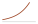
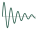
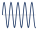
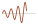

# Week 3 — Transfer Functions and the s-Plane
## What this week covers { #what-this-week-covers }

/// admonition | By the end of this week you should be able to
    type: abstract

- Solve a linear constant-coefficient differential equation with non-zero initial conditions by Laplace transform, and separate the forced response from the natural response in the answer.

- Define the transfer function of an LTI system and derive it directly from the system differential equation, stating the zero-initial-condition assumption that makes the definition legitimate.

- Obtain a transfer function of an electrical network in one step using the impedances $R$, $Ls$ and $1/Cs$, without first writing a differential equation.

- Find the poles and zeros of a transfer function, draw its pole–zero map, and read the form of the natural response off the pole locations alone.

- Invert a rational transfer function by partial fractions for distinct real poles and for a complex-conjugate pair.

- Explain what a zero does to a response — and what it does not do — including the initial undershoot of a non-minimum-phase system.

- Compute the d.c. gain of a transfer function and state the condition under which the final value theorem may be applied at all.

- State the discrete-time counterparts of the transfer function and of the stability region, and write the transfer function of a pure time delay, distinguishing it from the transient specification called delay time.

///

/// admonition | Reading
    type: quote

**Primary** — Khalil, §2-1 Differential Equation and Transfer Function Models (pp. 10–14); Appendix A, Review of the Laplace Transform (p. 438); Appendix C, Laplace and $z$-Transform Tables (p. 444). 
**Secondary** — Nise (6th ed.), §2.3 The Transfer Function (p. 44); §4.2 Poles, Zeros, and System Response (p. 162); §10.12 Systems with Time Delay (p. 597, concept only — the Bode treatment there belongs to Week 10). 
**Further** — Sundararajan, §2.1–2.3.

///

*Contact hours this week:* 2 h lecture $+$ 1 h tutorial. 
*Syllabus items addressed:* “Laplace transform solution to a linear constant-coefficient differential equation. Transfer functions as developed from system differential equations. Definitions and properties in the $s$-plane.” (Transfer Functions); “Continuous and discrete time-invariant systems. Delay time.” (Time Domain Linear Systems Analysis); “Pole-zero map” (S-Domain Analysis). 
*Expected learning outcomes:* ELO 2 — *analyse a control system solution in the time- and frequency-domains*; ELO 4 — *analyse the stability of a control system* (the pole-location picture built here is the stability picture used from Week 7 onward).

**A note on the two halves.** The first lecture hour is about getting a transfer function: the Laplace transform as a method of solving differential equations, the definition of the transfer function, and the impedance shortcut that was promised at the end of Week 2. The second hour is about reading one: poles, zeros, the pole–zero map, d.c. gain, and the two extensions the syllabus asks for — discrete-time systems and pure time delay. Week 2 built models; this week turns them into the object that every remaining week of FEE3411 operates on.

## Part A — From differential equation to transfer function { #partmarker-part-a-from-differential-equation-to-transfer-function }

### 1. Why the Laplace transform { #sec:laplace }

Week 2 ended with differential-equation models. Solving them in the time domain means finding a complementary function, finding a particular integral, and fixing constants from initial conditions — a different piece of work for every new input. The Laplace transform replaces all of that with algebra.

The (one-sided) Laplace transform of $f(t)$ is 

$$\begin{equation}
  F(s) = \mathcal{L}\{f(t)\} = \int_{0^-}^{\infty} f(t)\,e^{-st}\,dt ,
  \tag{1}
\end{equation}$$

 where $s=\sigma+\mathrm{j}\omega$ is a complex variable (Khalil, p. 438). The lower limit is written $0^-$, just *before* $t=0$, so that an impulse applied at the origin is captured rather than half-captured. Table [1](#tab:pairs) lists the pairs and properties used in this unit; Khalil’s Appendix C (p. 444) is the fuller table to work from.

\@llll@ & 
$f(t),\ t\ge0$ & $F(s)$ & & 
$\delta(t)$ & $1$ & Linearity & $\alpha f_1+\beta f_2 \ \to\ \alpha F_1+\beta F_2$ 
$1(t)$ (unit step) & $1/s$ & First derivative & $\dot f \ \to\ sF(s)-f(0^-)$ 
$t$ & $1/s^{2}$ & Second derivative& $\ddot f \ \to\ s^{2}F(s)-sf(0^-)-\dot f(0^-)$ 
$e^{-at}$ & $1/(s+a)$ & Integral & $\int_{0}^{t}\!f \ \to\ F(s)/s$ 
$t e^{-at}$ & $1/(s+a)^{2}$ & Time shift & $f(t-\tau)1(t-\tau)\ \to\ e^{-\tau s}F(s)$ 
$\sin\omega t$ & $\omega/(s^{2}+\omega^{2})$ & Frequency shift & $e^{-at}f(t)\ \to\ F(s+a)$ 
$\cos\omega t$ & $s/(s^{2}+\omega^{2})$ & Initial value & $f(0^{+})=\lim_{s\to\infty}sF(s)$ 
$e^{-at}\sin\omega t$ & $\omega/[(s+a)^{2}+\omega^{2}]$ & Final value & $f(\infty)=\lim_{s\to0}sF(s)$, *if stable* 
$e^{-at}\cos\omega t$ & $(s+a)/[(s+a)^{2}+\omega^{2}]$ & Convolution & $f_1*f_2 \ \to\ F_1F_2$ 

The derivative properties are the ones that do the work. Because $\mathcal{L}\{\dot f\}=sF(s)-f(0^-)$ and $\mathcal{L}\{\ddot f\}=s^2F(s)-sf(0^-)-\dot f(0^-)$, transforming a differential equation turns every derivative into a power of $s$ and every initial condition into an additive constant. What was a differential equation in $t$ becomes a polynomial equation in $s$, which is solved by rearrangement.

/// admonition | Key idea
    type: info

The transform does three things at once: it turns differentiation into multiplication by $s$, it turns convolution into multiplication, and it carries the initial conditions into the algebra automatically instead of leaving them to be fitted at the end. The price is that the answer comes back in the $s$-domain and has to be inverted — which is what §[8](#sec:partial) is about.

///

### 2. Solving a linear constant-coefficient ODE { #sec:ode-solution }

The procedure is mechanical:

1.  Transform every term of the differential equation, keeping the initial conditions.

2.  Collect the terms in $Y(s)$ and solve for $Y(s)$ — ordinary algebra.

3.  Split $Y(s)$ into partial fractions.

4.  Invert term by term using Table [1](#tab:pairs).

/// admonition | Worked example 3.1 — an ODE with non-zero initial conditions
    type: example

Solve 

$$\ddot y + 3\dot y + 2y = 2u(t), \qquad u(t)=1(t), \qquad
  y(0^-)=2, \quad \dot y(0^-)=0 .$$

**Step 1 — transform.** Using the derivative properties, 

$$\bigl[s^{2}Y - s\,y(0^-) - \dot y(0^-)\bigr]
  + 3\bigl[sY - y(0^-)\bigr] + 2Y = \frac{2}{s} .$$

 Substituting $y(0^-)=2$ and $\dot y(0^-)=0$, 

$$s^{2}Y - 2s + 3sY - 6 + 2Y = \frac{2}{s} .$$

**Step 2 — solve for $Y(s)$.** 

$$Y(s)\,(s^{2}+3s+2) = \frac{2}{s} + 2s + 6
  \qquad\Longrightarrow\qquad
  Y(s) = \underbrace{\frac{2}{s(s+1)(s+2)}}_{\text{forced}}
       + \underbrace{\frac{2s+6}{(s+1)(s+2)}}_{\text{natural}} .$$

 Note that $s^{2}+3s+2=(s+1)(s+2)$ is the *characteristic polynomial* of Week 2 — it appears as the denominator of both terms, whatever the input and whatever the initial conditions.

**Step 3 — partial fractions.** Term by term, 

$$\frac{2}{s(s+1)(s+2)} = \frac{1}{s} - \frac{2}{s+1} + \frac{1}{s+2},
  \qquad
  \frac{2s+6}{(s+1)(s+2)} = \frac{4}{s+1} - \frac{2}{s+2},$$

 so that 

$$Y(s) = \frac{1}{s} + \frac{2}{s+1} - \frac{1}{s+2} .$$

**Step 4 — invert.** 

$$\boxed{\,y(t) = 1 + 2e^{-t} - e^{-2t}\,}, \qquad t\ge 0 .$$

**Check.** $y(0)=1+2-1=2$ ;  $\dot y(0)=-2+2=0$ ;  $y(\infty)=1$, the steady state the step input should produce. The constant term is the *forced* response; the two exponentials, whose rates $-1$ and $-2$ are the roots of the characteristic equation, are the *natural* response.

///

Two features of that answer are general and worth stating separately. The *shape* of the natural response — which exponentials appear — is set by the characteristic equation, that is, by the plant. The *size* of each term is set by the input and the initial conditions. This separation is the whole reason the $s$-plane picture in Part B is useful.

### 3. The transfer function { #sec:tf }

Initial conditions describe how the system happened to be started, not what the system *is*. To characterise the system itself, set them all to zero.

/// admonition | Key idea
    type: info

The **transfer function** $G(s)$ of an LTI system is the ratio of the Laplace transform of the output to the Laplace transform of the input, with all initial conditions zero: 

$$G(s) = \frac{Y(s)}{U(s)}\bigg|_{\text{zero initial conditions}} .$$

 It is a property of the system alone. It does not depend on the input, and it does not depend on how the system was started.

///

Applying this to the general model of Week 2, 

$$a_n y^{(n)} + \cdots + a_1\dot y + a_0 y
  = b_m u^{(m)} + \cdots + b_1\dot u + b_0 u ,$$

 every derivative becomes a power of $s$ with no leftover constants, so 

$$\begin{equation}
  G(s) = \frac{Y(s)}{U(s)}
       = \frac{b_m s^{m} + b_{m-1}s^{m-1} + \cdots + b_1 s + b_0}
              {a_n s^{n} + a_{n-1}s^{n-1} + \cdots + a_1 s + a_0}
       = \frac{N(s)}{D(s)} .
  \tag{2}
\end{equation}$$

 Reading [(2)](#eq:tf-general) in reverse is just as useful: given a transfer function, the differential equation can be written straight back down by replacing $s^k Y$ with $y^{(k)}$ and $s^k U$ with $u^{(k)}$.

<figure id="fig:tf-block" data-latex-placement="htbp">

<figcaption><strong>Figure 1.</strong> The transfer function as a block: \(Y(s)=G(s)\,U(s)\). Multiplication in the \(s\)-domain replaces convolution in the time domain. Cf. Nise Fig. 2.2, p. 45.</figcaption>
</figure>

Several properties follow immediately from [(2)](#eq:tf-general), and each is used later in the unit:

- **The denominator is the characteristic polynomial.** Setting $D(s)=0$ gives the characteristic equation of Week 2. Every stability method from Week 7 onward is a statement about the roots of $D(s)$.

- **Order.** The order of the system is $n$, the degree of $D(s)$.

- **Proper and strictly proper.** A physical system has $m\le n$ (*proper*); most have $m<n$ (*strictly proper*). A transfer function with $m>n$ would differentiate its input more times than it integrates, which no physical device does. The difference $n-m$ is the **relative degree**, and §[9](#sec:zeros) shows it is visible in the very first instant of the step response.

- **The impulse response.** Since $\mathcal{L}\{\delta(t)\}=1$, the response to a unit impulse is $Y(s)=G(s)$, so $g(t)=\mathcal{L}^{-1}\{G(s)\}$. The transfer function *is* the impulse response, transformed.

- **Series connection.** Two blocks in cascade multiply: $Y=G_2G_1U$. This is the property Week 4 builds block-diagram algebra on.

/// admonition | Common pitfall
    type: warning

The zero-initial-condition assumption is part of the definition, not an approximation — but it does not mean initial conditions are unimportant. When a problem gives non-zero initial conditions, go back to the method of §[2](#sec:ode-solution); the transfer function alone cannot express them. A transfer function tells you how the system responds to an *input*, not how it decays from a *state*.

///

### 4. Worked example: the series *RLC* network { #sec:rlc }

Week 2 derived the differential equation of the series $RLC$ network of Figure [2](#fig:rlc)(a) from Kirchhoff’s voltage law: 

$$LC\,\ddot v_o + RC\,\dot v_o + v_o = v_i .$$

<figure id="fig:rlc" data-latex-placement="htbp">

<figcaption><strong>Figure 2.</strong> The series \(RLC\) network of Week 2, drawn (a) with its components and (b) with their \(s\)-domain impedances. The output is the capacitor voltage in both. Cf. Khalil Fig. 2-4, p. 17.</figcaption>
</figure>

/// admonition | Worked example 3.2 — transfer function of the series $RLC$ network
    type: example

With zero initial conditions, transform the differential equation directly: 

$$LCs^{2}V_o(s) + RCsV_o(s) + V_o(s) = V_i(s)
  \qquad\Longrightarrow\qquad
  \boxed{\ \frac{V_o(s)}{V_i(s)} = \frac{1}{LCs^{2}+RCs+1}\ } .$$

 Take $R=3\,\Omega$, $L=1\,\mathrm{H}$, $C=0.5\,\mathrm{F}$. Then $LC=0.5$ and $RC=1.5$, so 

$$G(s) = \frac{1}{0.5s^{2}+1.5s+1}
       = \frac{2}{s^{2}+3s+2}
       = \frac{2}{(s+1)(s+2)} .$$

 The characteristic equation is $s^{2}+3s+2=0$, with roots $s=-1$ and $s=-2$: two distinct, real, negative roots, so the natural response is the sum of two decaying exponentials and there is no oscillation. The d.c. gain is $G(0)=2/2=1$, so a constant input is passed through unchanged in the steady state — as it must be, since in steady state the inductor is a short circuit and the capacitor an open circuit, and the whole source voltage appears across $C$.

///

### 5. The impedance shortcut { #sec:impedance }

Week 2 promised that the differential equation could be skipped entirely for an electrical network. Here is why. Transforming the element relations of Week 2 with zero initial conditions gives 

$$V_R(s) = R\,I(s), \qquad
  V_L(s) = Ls\,I(s), \qquad
  V_C(s) = \frac{1}{Cs}\,I(s),$$

 so each element obeys $V=ZI$ — Ohm’s law, with a complex **impedance** $Z$ in place of a resistance: 

$$Z_R = R, \qquad Z_L = Ls, \qquad Z_C = \frac{1}{Cs} .$$

/// admonition | Key idea
    type: info

Impedances in series add, and impedances in parallel combine as reciprocals, exactly as resistances do. So an $s$-domain network can be reduced by the ordinary rules of resistive circuit analysis — voltage dividers, current dividers, series/parallel combination — and the transfer function drops out without a differential equation ever being written.

///

For Figure [2](#fig:rlc)(b), the output is taken across $Z_C$ in a series loop, so the voltage divider gives the result in one line: 

$$\frac{V_o(s)}{V_i(s)} = \frac{Z_C}{Z_R+Z_L+Z_C}
  = \frac{1/Cs}{R+Ls+1/Cs}
  = \frac{1}{LCs^{2}+RCs+1},$$

 in agreement with Worked example 3.2. The same shortcut generalises to any network: write Kirchhoff’s laws in the $s$-domain with impedances and solve the resulting algebraic equations. Week 4 will use it constantly.

/// admonition | Common pitfall
    type: warning

The impedance shortcut is only valid with *zero initial conditions* — no initial inductor current, no initial capacitor charge. That is exactly the condition under which a transfer function is defined, so for transfer-function work the shortcut is always available. If a question gives an initial capacitor voltage and asks for the full response, the shortcut does not apply and the method of §[2](#sec:ode-solution) is required.

///

## Part B — Reading a transfer function: the *s*-plane { #partmarker-part-b-reading-a-transfer-function-the-s-plane }

### 6. Poles, zeros and the pole–zero map { #sec:polezero }

Write the transfer function in factored form: 

$$\begin{equation}
  G(s) = K\,\frac{(s-z_1)(s-z_2)\cdots(s-z_m)}{(s-p_1)(s-p_2)\cdots(s-p_n)} .
  \tag{3}
\end{equation}$$

- The **zeros** $z_1,\dots,z_m$ are the roots of the numerator: the values of $s$ at which $G(s)=0$.

- The **poles** $p_1,\dots,p_n$ are the roots of the denominator: the values of $s$ at which $G(s)$ becomes infinite. They are the roots of the characteristic equation.

- $K$ is the **gain factor**. It is *not* the d.c. gain — see §[10](#sec:dcgain).

Because the coefficients of $N(s)$ and $D(s)$ are real, any complex poles or zeros occur in conjugate pairs, so the pole–zero map is always symmetric about the real axis. Plotting poles as $\times$ and zeros as $\circ$ on the complex plane gives the **pole–zero map**, and that picture is essentially the whole of the system’s dynamics.

<figure id="fig:pzmap" data-latex-placement="htbp">

<figcaption><strong>Figure 3.</strong> Pole–zero map of \(G(s)=4(s+3)/\bigl[(s+1)(s^{2}+2s+10)\bigr]\): poles (\(\times\)) at \(-1\) and \(-1\pm\mathrm{j}3\), a zero (\(\circ\)) at \(-3\). Cf. Nise §4.2, p. 162.</figcaption>
</figure>

### 7. The poles set the natural modes { #sec:modes }

Partial-fraction expansion of $Y(s)=G(s)U(s)$ produces one term for each pole. Each term inverts to a characteristic function of time, called a **mode**, and the pole’s position in the plane fixes which function it is. Real part $\sigma$ controls growth or decay; imaginary part $\omega$ controls oscillation. Table [2](#tab:modes) is the dictionary.

| **Pole location** | **Term in $y(t)$** | **Shape** |
|:---|:---|:--:|
| Negative real, $s=-a$ | $Ae^{-at}$, decaying |  |
| At the origin, $s=0$ | $A$, constant (an integrator) |  |
| Positive real, $s=+a$ | $Ae^{+at}$, growing |  |
| Complex pair, $s=-a\pm\mathrm{j}\omega$ | $Ae^{-at}\sin(\omega t+\phi)$, damped oscillation |  |
| Pair on the $\mathrm{j}\omega$ axis, $s=\pm\mathrm{j}\omega$ | $A\sin(\omega t+\phi)$, sustained |  |
| Complex pair, $s=+a\pm\mathrm{j}\omega$ | $Ae^{+at}\sin(\omega t+\phi)$, growing |  |

**Table 1.** Pole location and the mode it contributes to the natural response.

The pattern in Table [2](#tab:modes) has one consequence large enough to organise the rest of the unit around.

/// admonition | Key idea
    type: info

Every mode decays if and only if its pole has a *strictly negative real part*. So an LTI system is stable exactly when all of its poles lie in the open left half of the $s$-plane. A single pole in the right half plane, however small the rest of the system’s margins, makes the whole response grow without bound.

///

<figure id="fig:splane-regions" data-latex-placement="htbp">

<figcaption><strong>Figure 4.</strong> The stability picture in the \(s\)-plane. Every stability test in Weeks 7–12 — Routh–Hurwitz, root locus, Nyquist — is a different way of answering the same question: are any poles to the right of the imaginary axis?</figcaption>
</figure>

### 8. Inverse Laplace by partial fractions { #sec:partial }

Getting from $Y(s)$ back to $y(t)$ means splitting $Y(s)$ into terms that appear in Table [1](#tab:pairs). Three cases cover everything met in this unit.

###### Distinct real poles.

Write one term per pole and find each residue by the cover-up rule: multiply through by that factor and evaluate at the pole. This is the case of Worked example 3.1.

###### Repeated poles.

A factor $(s+a)^{r}$ needs $r$ terms, $A_1/(s+a)+A_2/(s+a)^2+\cdots+A_r/(s+a)^r$, and inverts to terms in $e^{-at}$, $te^{-at}$, …, $t^{r-1}e^{-at}$.

###### Complex-conjugate poles.

A quadratic factor $s^{2}+2\zeta\omega_{n}s+\omega_{n}^{2}$ that does not factor over the reals is best kept whole and matched to the last two pairs of Table [1](#tab:pairs) by completing the square, rather than split into two complex terms.

/// admonition | Worked example 3.3 — a complex-pole step response
    type: example

Find the unit-step response of 

$$G(s) = \frac{10}{s^{2}+2s+10} .$$

**Poles.** $s = \dfrac{-2\pm\sqrt{4-40}}{2} = -1\pm\mathrm{j}3$: a complex pair in the left half plane, so the response is a damped oscillation. Comparing with $s^{2}+2\zeta\omega_{n}s + \omega_{n}^{2}$ gives $\omega_{n}=\sqrt{10}=3.16\,\mathrm{rad}\,\mathrm{s}^{-1}$ and $\zeta= 2/(2\omega_{n}) = 1/\sqrt{10}=0.316$ — the notation of Week 5.

**Expand.** With $U(s)=1/s$, 

$$Y(s) = \frac{10}{s\,(s^{2}+2s+10)} = \frac{1}{s} - \frac{s+2}{s^{2}+2s+10} .$$

**Complete the square.** $s^{2}+2s+10=(s+1)^{2}+3^{2}$, so 

$$\frac{s+2}{(s+1)^{2}+3^{2}}
  = \frac{(s+1)}{(s+1)^{2}+3^{2}} + \frac{1}{3}\cdot\frac{3}{(s+1)^{2}+3^{2}} ,$$

 which matches the $e^{-at}\cos\omega t$ and $e^{-at}\sin\omega t$ pairs with $a=1$, $\omega=3$. Hence 

$$\boxed{\ y(t) = 1 - e^{-t}\Bigl(\cos 3t + \tfrac{1}{3}\sin 3t\Bigr)\ },
  \qquad t\ge0 .$$

**Check.** $y(0)=1-(1+0)=0$ ;  $y(\infty)=1=G(0)$ . The envelope decays as $e^{-t}$, set by the real part of the poles; the ringing is at $3\,\mathrm{rad}\,\mathrm{s}^{-1}$, set by the imaginary part.

///

/// admonition | Common pitfall
    type: warning

Do not split a complex-conjugate pair into two separate first-order terms with complex residues unless you intend to recombine them. It is legitimate, but the algebra is error-prone and the answer arrives as a sum of complex exponentials that still has to be turned back into a real sine and cosine. Completing the square keeps everything real from start to finish.

///

### 9. What zeros do { #sec:zeros }

Poles determine *which* modes appear. Zeros do not create modes at all — they change how much of each mode appears, by changing the residues. The effect is easiest to see by holding the poles and the d.c. gain fixed and moving a single zero.

/// admonition | Worked example 3.4 — one zero
    type: example

All three systems below have poles at $-1$ and $-2$ and d.c. gain $1$. They differ only in their zero: 

$$G_1(s) = \frac{2}{(s+1)(s+2)}, \qquad
  G_2(s) = \frac{2}{3}\,\frac{s+3}{(s+1)(s+2)}, \qquad
  G_3(s) = \frac{2}{3}\,\frac{3-s}{(s+1)(s+2)} .$$

 $G_1$ has no zero; $G_2$ has a zero at $s=-3$ (left half plane); $G_3$ has a zero at $s=+3$ (right half plane). Expanding each step response by partial fractions: 

$$y_1(t) = 1 - 2e^{-t} + e^{-2t}, \qquad
  y_2(t) = 1 - \tfrac{4}{3}e^{-t} + \tfrac{1}{3}e^{-2t}, \qquad
  y_3(t) = 1 - \tfrac{8}{3}e^{-t} + \tfrac{5}{3}e^{-2t} .$$

 The same two exponentials appear in all three — only the coefficients differ. Yet the responses behave very differently at the start: 

$$\dot y_1(0)=0, \qquad \dot y_2(0)=+\tfrac{2}{3}, \qquad
  \dot y_3(0)=-\tfrac{2}{3} .$$

 $G_1$, with relative degree $2$, leaves the origin with zero slope. $G_2$ and $G_3$, with relative degree $1$, leave with finite slope — and $G_3$ leaves in the *wrong direction*, dipping to a minimum of $y_3=-1/15$ at $t=\ln(5/4)=0.223\,\mathrm{s}$ before recovering and settling at $1$.

///

<figure id="fig:zeros" data-latex-placement="htbp">

<figcaption><strong>Figure 5.</strong> Step responses of the three systems of Worked example 3.4. Identical poles and identical d.c. gain; only the zero differs. The right-half-plane zero of \(G_3\) produces the initial undershoot.</figcaption>
</figure>

/// admonition | Key idea
    type: info

A zero adds no new mode and changes no time constant — the exponentials are the same in all three responses of Figure [5](#fig:zeros). What it changes is the *weighting* of the modes, and therefore the shape of the transient. A zero in the right half plane produces an initial response in the wrong direction; such a system is called **non-minimum-phase**.

///

/// admonition | Common pitfall
    type: warning

A right-half-plane *zero* does not make a system unstable — $G_3$ settles perfectly well at $1$. Only right-half-plane *poles* cause instability. What a right-half-plane zero does is make the system hard to control, because feedback that reacts to the initial wrong-way motion pushes in the wrong direction; this reappears in Week 8 as the characteristic shape of a non-minimum-phase root locus.

///

### 10. D.c. gain and the final value theorem { #sec:dcgain }

For a constant input, all derivatives vanish in the steady state, so $s\to0$ in the transfer function. The **d.c. gain** (or steady-state gain) is 

$$\begin{equation}
  G(0) = \frac{b_0}{a_0} ,
  \tag{4}
\end{equation}$$

 the ratio of the constant terms. It is the factor by which a constant input is multiplied once the transients have died away. For a unit step input, the steady-state output *is* $G(0)$.

The general statement is the final value theorem of Table [1](#tab:pairs): 

$$y(\infty) = \lim_{s\to0} sY(s) = \lim_{s\to0} sG(s)U(s) .$$

 With $U(s)=1/s$ this reduces to $y(\infty)=G(0)$, as used to check every worked example above.

/// admonition | Common pitfall
    type: warning

The final value theorem is only valid if the final value *exists* — that is, if all poles of $sY(s)$ lie strictly in the left half plane. Applied blindly to the unstable system $G(s)=1/(s-1)$ it gives $y(\infty)=G(0)=-1$, whereas the true step response is $y(t)=e^{t}-1$, which grows without bound. Check stability first; the theorem cannot detect its own misuse.

///

Note also that the gain factor $K$ of the factored form [(3)](#eq:factored) is not the d.c. gain. For $G_2$ of Worked example 3.4, $K=2/3$ but $G_2(0)=\tfrac{2}{3}\cdot\tfrac{3}{2}=1$. Multiplying the poles and zeros back in is the only safe way to get the steady-state gain.

### 11. Discrete time-invariant systems { #sec:discrete }

Everything so far assumes a signal defined for every instant $t$. A digital controller instead sees samples $u[k]=u(kT)$ at a sampling period $T$, and its model is a **difference** equation rather than a differential one: 

$$y[k] + \alpha_1 y[k-1] + \cdots + \alpha_n y[k-n]
  = \beta_0 u[k] + \cdots + \beta_m u[k-m] .$$

 The $z$-transform, $Y(z)=\sum_{k=0}^{\infty}y[k]z^{-k}$, plays exactly the role the Laplace transform plays for continuous signals. Its key property is the shift rule: with zero initial conditions, a one-step delay $y[k-1]$ transforms to $z^{-1}Y(z)$. So a delay becomes multiplication by $z^{-1}$, just as differentiation became multiplication by $s$, and the same argument as §[3](#sec:tf) gives a **pulse transfer function** $G(z)=Y(z)/U(z)$.

/// admonition | Worked example 3.5 — a first-order discrete system
    type: example

For $y[k] = 0.5\,y[k-1] + u[k]$, transforming with zero initial conditions gives $Y(z)\bigl(1-0.5z^{-1}\bigr) = U(z)$, so 

$$G(z) = \frac{1}{1-0.5z^{-1}} = \frac{z}{z-0.5},$$

 a single pole at $z=0.5$. The unit-step response is $y[k] = 2 - (0.5)^{k}$, giving $1,\ 1.5,\ 1.75,\ 1.875,\dots$ and converging to $G(1)=1/(1-0.5)=2$ — the discrete d.c. gain, evaluated at $z=1$ rather than $s=0$.

///

The stability region changes shape with the transform. A continuous mode $e^{st}$ sampled at spacing $T$ becomes $z^{k}$ with $z=e^{sT}$, and that mapping sends the left half plane to the interior of the unit circle.

/// admonition | Key idea
    type: info

A continuous system is stable when every pole satisfies $\mathrm{Re}(s)<0$; a discrete system is stable when every pole satisfies $|z|<1$. Same idea, different picture: the imaginary axis becomes the unit circle.

///

<figure id="fig:s-vs-z" data-latex-placement="htbp">

<figcaption><strong>Figure 6.</strong> Stability regions compared. The map \(z=e^{sT}\) carries the shaded left half plane onto the shaded interior of the unit circle.</figcaption>
</figure>

FEE3411 works entirely in continuous time; this section exists because the syllabus asks for the comparison, and because every controller you will actually build is a discrete one running on a processor.

### 12. Pure time delay, and delay time { #sec:delay }

A conveyor belt, a length of pipe, a communication link and a computation all introduce a **pure time delay** (or transport lag): the output is the input, unchanged in shape, but later by $\tau$ seconds. By the time-shift property of Table [1](#tab:pairs), 

$$y(t) = u(t-\tau)\,1(t-\tau)
  \qquad\Longrightarrow\qquad
  \frac{Y(s)}{U(s)} = e^{-\tau s} .$$

<figure id="fig:delay" data-latex-placement="htbp">

<figcaption><strong>Figure 7.</strong> A pure time delay reproduces the input shape exactly, \(\tau\) seconds later. (The two traces are drawn at slightly different heights only so that both remain visible.)</figcaption>
</figure>

/// admonition | Common pitfall
    type: warning

$e^{-\tau s}$ is *not* a rational function, so a system containing a pure delay has no finite set of poles and zeros and cannot be drawn on a pole–zero map. Every method in this unit that relies on a polynomial characteristic equation — Routh–Hurwitz in Week 7, root locus in Week 8 — therefore does not apply directly to a delay. The frequency-domain methods of Weeks 10–12 do, because $e^{-\mathrm{j}\omega\tau}$ has magnitude $1$ and phase $-\omega\tau$, which is simply added to the phase plot. This is why Nise treats time delay in §10.12 (p. 597), inside the Bode chapter, rather than in the transfer-function chapter.

///

Where a rational approximation is needed, the **Padé approximation** supplies one. The first-order form (Khalil, p. 14) is 

$$\begin{equation}
  e^{-\tau s} \approx \frac{1-\tau s/2}{1+\tau s/2} ,
  \tag{5}
\end{equation}$$

 whose series expansion agrees with $e^{-\tau s}$ up to and including the $s^{2}$ term. Notice where its zero sits: at $s=+2/\tau$, in the right half plane. A delay behaves like a non-minimum-phase system in exactly the sense of §[9](#sec:zeros) — which is the analytical reason delay is so damaging to a feedback loop.

/// admonition | Common pitfall
    type: warning

The syllabus phrase *delay time* means something different from the pure time delay $\tau$ of this section. Delay time $t_d$ is a transient specification — the time a step response takes to reach $50\%$ of its final value — and is defined in Week 5 for systems with no transport lag at all. A system can have a delay time of 0.4 s and no time delay whatsoever. Read which one a question means from its context.

///

## Summary { #summary }

- The Laplace transform turns a linear constant-coefficient differential equation into algebra, carrying initial conditions in automatically through $\mathcal{L}\{\dot f\}=sF(s)-f(0^-)$.

- The transfer function $G(s)=Y(s)/U(s)$, defined with zero initial conditions, is a property of the plant alone. Its denominator is the characteristic polynomial, its inverse transform is the impulse response, and blocks in cascade multiply.

- For an electrical network, the impedances $R$, $Ls$, $1/Cs$ give the transfer function directly by voltage- and current-divider algebra, with no differential equation.

- Poles are the roots of the denominator, zeros the roots of the numerator; both are plotted on the pole–zero map, which is symmetric about the real axis.

- Each pole contributes one mode: real part sets growth or decay, imaginary part sets oscillation. A system is stable exactly when every pole lies in the open left half plane.

- Zeros add no modes; they reweight the residues and so reshape the transient. A right-half-plane zero causes initial undershoot (non-minimum-phase) but does not cause instability.

- The d.c. gain is $G(0)=b_0/a_0$, and is not the gain factor $K$. The final value theorem gives it, but only for a stable system.

- Discrete systems use $G(z)$ in place of $G(s)$, with the stability region the unit circle instead of the left half plane. A pure time delay has transfer function $e^{-\tau s}$, is not rational, and is distinct from the transient specification called delay time.

## Before the tutorial { #before-the-tutorial }

1.  Using impedances only, find $V_o(s)/V_i(s)$ for a series $RC$ network with the output taken across the resistor. Identify its pole, its zero and its d.c. gain, and say in one sentence what kind of filter it is.

2.  A system has poles at $-2$ and $-5$, a zero at $-10$, and d.c. gain $3$. Write its transfer function in both factored and polynomial form, and state its relative degree.

3.  Find the unit-step response of $G(s)=6/\bigl[(s+1)(s+3)\bigr]$ by partial fractions, and verify your answer at $t=0$ and $t\to\infty$.

4.  Without computing anything, sketch the shape of the natural response of a system whose poles are at $-0.5\pm\mathrm{j}8$, and say which feature of the sketch is set by the $-0.5$ and which by the $8$.

## Looking ahead { #looking-ahead }

Week 4 keeps the transfer functions built here and asks how they combine when subsystems are wired together: block-diagram representation, the canonical feedback form, the reduction rules, and signal flow graphs with Mason’s gain formula. The impedance shortcut of §[5](#sec:impedance) and the cascade rule of §[3](#sec:tf) are the two results Week 4 leans on hardest. Assignment 2, issued at the start of Week 4 and due in Week 6, covers Weeks 3 and 4 together — so the partial-fraction and transfer-function work of this week is examined alongside next week’s material, and is worth consolidating now rather than revisiting cold. Beyond that, the pole–zero map of §[6](#sec:polezero) is the picture the rest of the unit is drawn on: Week 5 reads transient specifications off pole positions, Week 7 tests whether any pole has crossed into the right half plane, and Week 8 tracks how the poles move as a gain is varied. Locating those poles is *analysis* and belongs here; choosing a compensator to put them somewhere better is design, and belongs to FEE3412.
