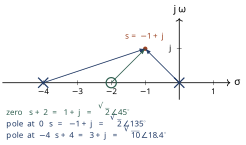
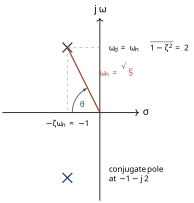

# Tutorial 1 — Mathematical toolkit: Laplace, partial fractions, the s-plane
**QUESTIONS AND SOLUTIONS** 
*Instructor copy — do not circulate before the tutorial.*

This hour is a **review**, not new material. Everything here you have met in FEE 222 or FEE 372; the purpose is to get it back into working order, because from Week 2 onwards it is assumed silently in every derivation.

Questions marked **\[in the hour\]** are the ones we work through together. Those marked **\[homework\]** you do in your own time — they are not collected, but Week 2 assumes you have done them.

*Preparation:* Khalil Appendix A (p. 438) or Nise §2.2 (p. 35).

/// admonition | Reading
    type: quote

**The toolkit you should be able to use without looking anything up.**

**Pairs** 

|                       |                                 |
|:----------------------|:--------------------------------|
| $\delta(t)$           | $1$                             |
| $u(t)$                | $1/s$                           |
| $t$                   | $1/s^{2}$                       |
| $t^{n}/n!$            | $1/s^{n+1}$                     |
| $e^{-at}$             | $1/(s+a)$                       |
| $t e^{-at}$           | $1/(s+a)^{2}$                   |
| $\sin\omega t$        | $\omega/(s^{2}+\omega^{2})$     |
| $\cos\omega t$        | $s/(s^{2}+\omega^{2})$          |
| $e^{-at}\sin\omega t$ | $\omega/[(s+a)^{2}+\omega^{2}]$ |
| $e^{-at}\cos\omega t$ | $(s+a)/[(s+a)^{2}+\omega^{2}]$  |

**Properties** 

|                 |                                                             |
|:----------------|:------------------------------------------------------------|
| Linearity       | $\mathcal{L}\{af+bg\}=aF+bG$                                |
| Differentiation | $\mathcal{L}\{\dot f\}=sF(s)-f(0^{-})$                      |
|                 | $\mathcal{L}\{\ddot f\}=s^{2}F(s)-s f(0^{-})-\dot f(0^{-})$ |
| Integration     | $\mathcal{L}\left\{\int_{0}^{t}\!f\right\}=F(s)/s$          |
| Frequency shift | $\mathcal{L}\{e^{-at}f(t)\}=F(s+a)$                         |
| Time shift      | $\mathcal{L}\{f(t-T)u(t-T)\}=e^{-sT}F(s)$                   |
| Initial value   | $f(0^{+})=\lim_{s\to\infty}sF(s)$                           |
| Final value     | $f(\infty)=\lim_{s\to 0}sF(s)$                              |
|                 | *only if all poles of $sF(s)$*                              |
|                 | *have negative real parts*                                  |

///

## Question 1 — Standard test signals *\[in the hour\]* { #question-1-standard-test-signals-in-the-hour }

1.  Sketch, on the same time axis, the unit impulse $\delta(t)$, unit step $u(t)$, unit ramp $r(t)=t\,u(t)$ and unit parabola $p(t)=\tfrac{1}{2}t^{2}u(t)$. Write down the Laplace transform of each.

2.  Show that each signal in the list is the time integral of the one before it. Using the integration property only, deduce the transforms $1/s$, $1/s^{2}$, $1/s^{3}$ from $\mathcal{L}\{\delta\}=1$.

3.  Why does a control engineer test with *these* signals rather than, say, a sine wave or a recorded real input?

/// details | Solution
    type: note

**(a)** $\mathcal{L}\{\delta\}=1$, $\mathcal{L}\{u\}=1/s$, $\mathcal{L}\{r\}=1/s^{2}$, $\mathcal{L}\{p\}=1/s^{3}$. The sketches: an arrow of unit area at the origin; a step to 1; a straight line of unit slope; an upward parabola.

**(b)** $u(t)=\int_{0}^{t}\delta(\tau)\,d\tau$, $r(t)=\int_{0}^{t}u(\tau)\,d\tau$, $p(t)=\int_{0}^{t}r(\tau)\,d\tau$. Each integration divides the transform by $s$, so $1\to 1/s\to 1/s^{2}\to 1/s^{3}$.

**(c)** Three reasons.

-   They form a *ladder of difficulty*: a step asks the system to reach a new constant value, a ramp to follow a constant velocity, a parabola a constant acceleration. In Week 6 we will see that a given system tracks some of these with zero error, some with finite error, and some not at all — that classification is *system type*.

-   They are simple enough that the response can be worked out by hand, so the answer is a formula you can reason about, not a number from a simulation.

-   Any realistic input can be built from them (or from impulses), so if you know the response to these you know a great deal about the response to everything else.

*Sine waves are not neglected* — the entire frequency-response half of this unit, Weeks 9–12, is the sinusoidal steady-state response.

///

## Question 2 — Transforms and properties *\[in the hour\]* { #question-2-transforms-and-properties-in-the-hour }

1.  From the definition $F(s)=\int_{0^{-}}^{\infty}f(t)e^{-st}\,dt$, derive $\mathcal{L}\{e^{-at}\}$. For which values of $s$ does the integral converge?

2.  Using the properties in the box, and *without* integrating, find 

$$\text{(i) } \mathcal{L}\{t\,e^{-3t}\}\qquad
            \text{(ii) } \mathcal{L}\{e^{-2t}\sin 4t\}\qquad
            \text{(iii) } \mathcal{L}\{e^{-(t-2)}u(t-2)\}$$

3.  Find $F(s)$ for $f(t)=5-3e^{-2t}\cos 4t$.

4.  For $\displaystyle F(s)=\frac{10(s+2)}{s(s^{2}+4s+13)}$, find $f(0^{+})$ and $f(\infty)$ without inverting.

5.  A student applies the final value theorem to $\displaystyle G(s)=\frac{5}{s^{2}+9}$ and reports $g(\infty)=0$. What has gone wrong?

/// details | Solution
    type: note

**(a)** 

$$\mathcal{L}\{e^{-at}\}=\int_{0}^{\infty}e^{-at}e^{-st}dt
  =\int_{0}^{\infty}e^{-(s+a)t}dt
  =\left[\frac{-e^{-(s+a)t}}{s+a}\right]_{0}^{\infty}
  =\frac{1}{s+a}.$$

 The upper limit vanishes only if $\mathrm{Re}(s+a)>0$, i.e. $\mathrm{Re}(s)>-a$. That half-plane is the *region of convergence*. We almost never mention it again, because in this unit the transform is a bookkeeping device rather than an object of study — but it is the reason the pole sits at $s=-a$.

**(b)**

1.  Frequency shift applied to $\mathcal{L}\{t\}=1/s^{2}$: $\;\mathcal{L}\{t e^{-3t}\}=\dfrac{1}{(s+3)^{2}}$.

2.  Frequency shift applied to $\mathcal{L}\{\sin 4t\}=4/(s^{2}+16)$: $\;\dfrac{4}{(s+2)^{2}+16}$.

3.  Time shift with $T=2$ applied to $\mathcal{L}\{e^{-t}\}=1/(s+1)$: $\;\dfrac{e^{-2s}}{s+1}$.

/// admonition | Common pitfall
    type: warning

In (iii) the exponent is $-(t-2)$, *not* $-t$, and the step is $u(t-2)$. Both must be shifted by the same amount or the time-shift property does not apply. $\mathcal{L}\{e^{-t}u(t-2)\}$ is a different (and messier) problem: write $e^{-t}=e^{-2}e^{-(t-2)}$ first, giving $e^{-2}e^{-2s}/(s+1)$.

///

**(c)** $\mathcal{L}\{5\}=5/s$ and, by frequency shift, $\mathcal{L}\{e^{-2t}\cos 4t\}=(s+2)/[(s+2)^{2}+16]$. Hence 

$$F(s)=\frac{5}{s}-\frac{3(s+2)}{(s+2)^{2}+16}
      =\frac{5}{s}-\frac{3(s+2)}{s^{2}+4s+20}
      =\frac{2(s^{2}+7s+50)}{s(s^{2}+4s+20)} .$$

**(d)** Initial value: 

$$f(0^{+})=\lim_{s\to\infty}sF(s)
   =\lim_{s\to\infty}\frac{10s(s+2)}{s^{2}+4s+13}=10 .$$

 Final value: the poles of $sF(s)$ are the roots of $s^{2}+4s+13$, namely $s=-2\pm j3$, both with negative real part, so the theorem applies: 

$$f(\infty)=\lim_{s\to 0}sF(s)=\frac{10\times 2}{13}=\frac{20}{13}\approx 1.538 .$$

**(e)** The theorem has been applied where it is not valid. The poles of $sG(s)=5s/(s^{2}+9)$ are at $s=\pm j3$ — on the imaginary axis, not strictly in the left half-plane. In fact $g(t)=\tfrac{5}{3}\sin 3t$, which oscillates forever and has no final value at all.

/// admonition | Common pitfall
    type: warning

The final value theorem returns a number whether or not it is entitled to. **Always check the poles of $sF(s)$ first.** This trap reappears in Week 6 whenever a steady-state error is computed for a system that is not actually stable — the algebra produces a tidy answer for a system that is in fact running away.

///

///

## Question 3 — Partial fractions *\[in the hour\]* { #question-3-partial-fractions-in-the-hour }

Expand each of the following and hence find $f(t)$. In each case check your answer against the initial and final value theorems.

1.  $\displaystyle F(s)=\frac{s+3}{s(s+1)(s+2)}$ (distinct real poles)

2.  $\displaystyle F(s)=\frac{s+4}{s(s+2)^{2}}$ (a repeated pole)

3.  $\displaystyle F(s)=\frac{10}{s(s^{2}+2s+5)}$ (a complex pair)

For (c), also read off the undamped natural frequency $\omega_{n}$ and damping ratio $\zeta$ of the quadratic factor.

/// details | Solution
    type: note

**(a)** Write $F=\dfrac{A}{s}+\dfrac{B}{s+1}+\dfrac{C}{s+2}$ and use the cover-up rule: 

$$A=\left.\frac{s+3}{(s+1)(s+2)}\right|_{s=0}=\frac{3}{2},\quad
  B=\left.\frac{s+3}{s(s+2)}\right|_{s=-1}=\frac{2}{(-1)(1)}=-2,$$

 

$$C=\left.\frac{s+3}{s(s+1)}\right|_{s=-2}=\frac{1}{(-2)(-1)}=\frac{1}{2}.$$

 

$$\boxed{\;f(t)=\tfrac{3}{2}-2e^{-t}+\tfrac{1}{2}e^{-2t}\;}$$

 *Checks.* $f(0)=1.5-2+0.5=0$, and indeed $sF(s)\to 0$ as $s\to\infty$ ($F$ is strictly proper by two degrees). $f(\infty)=1.5$, matching $\lim_{s\to 0}sF(s)=3/2$.

**(b)** With a repeated pole the expansion is $F=\dfrac{A}{s}+\dfrac{B}{s+2}+\dfrac{C}{(s+2)^{2}}$. 

$$A=\left.\frac{s+4}{(s+2)^{2}}\right|_{s=0}=\frac{4}{4}=1,
  \qquad
  C=\left.\frac{s+4}{s}\right|_{s=-2}=\frac{2}{-2}=-1 .$$

 For $B$, multiply through by $(s+2)^{2}$ and differentiate before substituting: 

$$B=\left.\frac{d}{ds}\!\left[\frac{s+4}{s}\right]\right|_{s=-2}
   =\left.\frac{d}{ds}\!\left[1+\frac{4}{s}\right]\right|_{s=-2}
   =\left.-\frac{4}{s^{2}}\right|_{s=-2}=-1 .$$

 

$$F(s)=\frac{1}{s}-\frac{1}{s+2}-\frac{1}{(s+2)^{2}}
  \qquad\Longrightarrow\qquad
  \boxed{\;f(t)=1-e^{-2t}-t\,e^{-2t}\;}$$

 *Checks.* $f(0)=1-1-0=0$; $f(\infty)=1=\lim_{s\to0}sF(s)=4/4$.

/// admonition | Common pitfall
    type: warning

The commonest error here is to forget the $B$ term entirely, or to try to find it by the cover-up rule (which gives $\infty$). A pole of multiplicity $m$ contributes $m$ terms, and all but the highest need the derivative trick.

///

**(c)** The quadratic $s^{2}+2s+5$ has roots $s=-1\pm j2$, which do not factorise over the reals, so keep it whole: 

$$F(s)=\frac{A}{s}+\frac{Bs+C}{s^{2}+2s+5},\qquad
  A=\left.\frac{10}{s^{2}+2s+5}\right|_{s=0}=2 .$$

 Multiplying up, $10=2(s^{2}+2s+5)+(Bs+C)s$, so matching coefficients gives $B=-2$ and $C=-4$. Now complete the square, $s^{2}+2s+5=(s+1)^{2}+2^{2}$, and split the numerator so that each piece matches a table entry: 

$$\frac{2s+4}{(s+1)^{2}+2^{2}}
  =\frac{2(s+1)}{(s+1)^{2}+2^{2}}+\frac{2}{(s+1)^{2}+2^{2}} .$$

 Hence 

$$F(s)=\frac{2}{s}-\frac{2(s+1)}{(s+1)^{2}+2^{2}}-\frac{2}{(s+1)^{2}+2^{2}}$$

 

$$\boxed{\;f(t)=2-2e^{-t}\cos 2t-e^{-t}\sin 2t\;}$$

 (the last term because $\mathcal{L}^{-1}\{2/[(s+1)^{2}+4]\}=e^{-t}\sin 2t$, the table entry needing $\omega=2$ in the numerator).

*Checks.* $f(0)=2-2-0=0$; $f(\infty)=2=\lim_{s\to0}sF(s)=10/5$.

Comparing $s^{2}+2s+5$ with the standard form $s^{2}+2\zeta\omega_{n}s+\omega_{n}^{2}$: 

$$\omega_{n}=\sqrt{5}\approx2.236\,\mathrm{rad}\,\mathrm{s}^{-1},
  \qquad
  2\zeta\omega_{n}=2 \;\Rightarrow\; \zeta=\frac{1}{\sqrt{5}}\approx 0.447 .$$

 Since $0<\zeta<1$ the response is **underdamped**, and the damped frequency $\omega_{d}=\omega_{n}\sqrt{1-\zeta^{2}}=2$ is exactly the $2$ appearing in $\sin 2t$ and $\cos 2t$. Week 5 does nothing to this result except give the quantities names.

///

## Question 4 — Complex numbers and the *s*-plane *\[in the hour\]* { #question-4-complex-numbers-and-the-s-plane-in-the-hour }

This question is the one that pays off most later: the graphical evaluation in part (b) is the whole basis of root-locus sketching in Week 8 and of Bode and Nyquist plots in Weeks 10–12.

Consider 

$$G(s)=\frac{4(s+2)}{s(s+4)} .$$

1.  Mark the poles ($\times$) and zeros ($\circ$) of $G$ on an $s$-plane diagram.

2.  Evaluate $G(s)$ at the point $s=-1+j$ **graphically**: draw the vector from each pole and zero to that point, measure (or compute) its length and angle, and combine them. Confirm your answer algebraically.

3.  A second-order system has poles at $s=-1\pm j2$. Write down the form of the corresponding time-domain term. On a sketch of the $s$-plane, mark $\omega_{n}$ and the angle $\theta$ from the negative real axis, and show that $\zeta=\cos\theta$. Evaluate both.

4.  In one sentence each: what does the *real* part of a pole control, and what does the *imaginary* part control?

/// details | Solution
    type: note

**(a)** Zero at $s=-2$; poles at $s=0$ and $s=-4$.

/// caption
**Figure 1.** image
///

///

**(b)** At $s=-1+j$ each factor is a vector *from* the critical point *to* the test point: 

$$\begin{array}{lll}
  s+2 = 1+j & |s+2|=\sqrt{2} & \angle(s+2)=\ang{45}\ 
  s     = -1+j & |s|=\sqrt{2} & \angle s=\ang{135}\ 
  s+4 = 3+j & |s+4|=\sqrt{10} & \angle(s+4)=\arctan\tfrac{1}{3}=\ang{18.435}
\end{array}$$

 Magnitudes of numerator factors divide by magnitudes of denominator factors; angles subtract: 

$$|G|=\frac{4\sqrt{2}}{\sqrt{2}\,\sqrt{10}}=\frac{4}{\sqrt{10}}=1.265,
  \qquad
  \angle G=\ang{45}-\ang{135}-\ang{18.435}=\ang{-108.435}.$$

 *Algebraic check.* 

$$G(-1+j)=\frac{4(1+j)}{(-1+j)(3+j)}=\frac{4+4j}{-4+2j}=-0.4-1.2j,$$

 whose magnitude is $\sqrt{0.16+1.44}=1.265$ and whose angle is $\ang{-108.435}$.

/// admonition | Key idea
    type: info

A transfer function evaluated at a point is nothing but *a product of vector lengths divided by another product of vector lengths, with the angles subtracted*. Every graphical method in the second half of this unit — the root-locus angle and magnitude conditions, the shape of a Bode plot near a corner, the shape of a Nyquist contour — is this one fact applied at different sets of points.

///

**(c)** Poles at $s=-1\pm j2$ correspond to the time-domain term 

$$e^{-t}\left(A\cos 2t+B\sin 2t\right)
  \quad\text{equivalently}\quad
  Ce^{-t}\sin(2t+\phi).$$

 On the $s$-plane, $\omega_{n}$ is the *distance from the origin* to the pole and $\theta$ the angle it makes with the negative real axis: 

$$\omega_{n}=\sqrt{1^{2}+2^{2}}=\sqrt{5}=2.236,
  \qquad
  \cos\theta=\frac{1}{\sqrt 5}=0.447
  \;\Rightarrow\; \theta=\ang{63.43}.$$

 Writing the pole as $-\zeta\omega_{n}\pm j\omega_{n}\sqrt{1-\zeta^{2}}$, the horizontal distance is $\zeta\omega_{n}$ and the hypotenuse is $\omega_{n}$, so $\cos\theta=\zeta\omega_{n}/\omega_{n}=\zeta$. Hence $\zeta=0.447$, the same value as in Question 3(c) — the same quadratic.

/// caption
**Figure 2.** image
///

**(d)** The **real** part sets the *decay rate* of the term: the envelope is $e^{\sigma t}$, so the further left the pole, the faster the transient dies away (and if $\sigma>0$ it grows instead — that is instability, Week 7). The **imaginary** part sets the *frequency of oscillation* within that envelope; a pole on the real axis ($\omega=0$) gives no oscillation at all.

## Question 5 — Solving a differential equation *\[homework\]* { #question-5-solving-a-differential-equation-homework }

The position servomechanism of this week’s lecture (Figure 5 of the notes), with a particular choice of amplifier gain, obeys 

$$\ddot{c}+4\dot{c}+8c=8r(t),$$

 where $r$ is the reference shaft angle and $c$ the load shaft angle.

1.  With the load initially at rest at the origin, $c(0)=\dot c(0)=0$, find $c(t)$ for a unit step reference $r(t)=u(t)$.

2.  Identify $\omega_{n}$ and $\zeta$. Is the response overdamped, critically damped or underdamped?

3.  Now set $r(t)=0$ but start the load displaced: $c(0)=1$, $\dot c(0)=0$. Find $c(t)$.

4.  Comment on what is the same and what is different between (a) and (c), and say which part of the answer is a property of the *system* rather than of the input.

/// details | Solution
    type: note

**(a)** Transforming with zero initial conditions, and $R(s)=1/s$: 

$$(s^{2}+4s+8)\,C(s)=\frac{8}{s}
  \qquad\Longrightarrow\qquad
  C(s)=\frac{8}{s(s^{2}+4s+8)} .$$

 Expanding as in Question 3(c): $A=8/8=1$, and $8=(s^{2}+4s+8)+(Bs+C)s$ gives $B=-1$, $C=-4$. With $s^{2}+4s+8=(s+2)^{2}+2^{2}$, 

$$C(s)=\frac{1}{s}-\frac{(s+2)}{(s+2)^{2}+2^{2}}-\frac{2}{(s+2)^{2}+2^{2}}$$

 

$$\boxed{\;c(t)=1-e^{-2t}\cos 2t-e^{-2t}\sin 2t\;}$$

 *Checks.* $c(0)=1-1-0=0$ ; $\dot c(0)=2(1)-(2-0)=0$ ; $c(\infty)=1$, matching $\lim_{s\to 0}sC(s)=8/8=1$ — the load ends up exactly where it was told to go, which is what the potentiometer feedback is for.

**(b)** Comparing $s^{2}+4s+8$ with $s^{2}+2\zeta\omega_{n}s+\omega_{n}^{2}$: 

$$\omega_{n}=\sqrt{8}=2.828,\qquad 2\zeta\omega_{n}=4\;\Rightarrow\;\zeta=\frac{4}{2\sqrt 8}
  =\frac{1}{\sqrt 2}=0.707 .$$

 Since $0<\zeta<1$ the system is **underdamped**: it overshoots and rings before settling. The poles are $s=-2\pm j2$, at $\ang{45}$ to the negative real axis — consistent with $\zeta=\cos\ang{45}=0.707$.

**(c)** Now the initial conditions do *not* vanish. Using $\mathcal{L}\{\ddot c\}=s^{2}C-sc(0)-\dot c(0)$ and $\mathcal{L}\{\dot c\}=sC-c(0)$: 

$$\left[s^{2}C-s\right]+4\left[sC-1\right]+8C=0
  \quad\Longrightarrow\quad
  C(s)=\frac{s+4}{s^{2}+4s+8}.$$

 Splitting as before, $s+4=(s+2)+2$: 

$$C(s)=\frac{s+2}{(s+2)^{2}+2^{2}}+\frac{2}{(s+2)^{2}+2^{2}}
  \qquad\Longrightarrow\qquad
  \boxed{\;c(t)=e^{-2t}\cos 2t+e^{-2t}\sin 2t\;}$$

 *Checks.* $c(0)=1$ , $\dot c(0)=-2+2=0$ , and $c(\infty)=0$ — the servo drives the disturbed load back to zero.

**(d)** The two answers contain *exactly the same* exponential and sinusoid: $e^{-2t}\cos 2t$ and $e^{-2t}\sin 2t$. Only the constant term and the signs differ.

That is not a coincidence. Those terms come from the roots of $s^{2}+4s+8=0$ — the **characteristic equation** — which depends only on the system, not on what is driving it or how it started. The input decides the *constant* (the forced or steady-state part); the system decides the *shape of the transient*.

/// admonition | Key idea
    type: info

The characteristic equation is the single most important object in this unit. Its roots are the poles of the closed-loop transfer function; they fix the transient response, and whether they lie in the left half-plane fixes stability. Weeks 7, 8, 11 and 12 are, between them, four different ways of answering one question: *where are the roots of the characteristic equation, and can I move them?*

///

///

## Question 6 — Time delay, and a warning about $s\to\infty$ *\[homework\]* { #question-6-time-delay-and-a-warning-about-stoinfty-homework }

1.  A sensor introduces a pure time delay of $T$ seconds: its output is the input, unchanged in shape, but arriving $T$ seconds late. Show from the time-shift property that its transfer function is $e^{-sT}$.

2.  A step of height $5$ is applied at $t=0$ to such a sensor with $T=0.4\,\mathrm{s}$. Write down the transform of the output, and sketch the output against time.

3.  Explain why $e^{-sT}$ is *not* a ratio of polynomials in $s$, and why that is inconvenient. (You are not expected to solve this problem yet — it is dealt with in Weeks 3 and 10.)

4.  Apply the initial value theorem to $\displaystyle F(s)=\frac{s+1}{s+2}$. Then find $f(t)$ properly and explain the discrepancy.

/// details | Solution
    type: note

**(a)** If the output is $y(t)=x(t-T)u(t-T)$ then, substituting $\tau=t-T$, 

$$Y(s)=\int_{0}^{\infty}\!x(t-T)u(t-T)e^{-st}dt
      =\int_{0}^{\infty}\!x(\tau)e^{-s(\tau+T)}d\tau
      =e^{-sT}X(s),$$

 so $Y(s)/X(s)=e^{-sT}$. Note $|e^{-j\omega T}|=1$ — a pure delay changes no amplitude at all. It contributes *only* phase lag, $-\omega T$ radians, growing without bound with frequency. That is exactly why delays destabilise feedback loops, as we shall see in Week 10.

**(b)** $Y(s)=\dfrac{5e^{-0.4s}}{s}$. The sketch is zero until $t=0.4\,\mathrm{s}$, then a step to $5$ — the same step, moved right.

**(c)** $e^{-sT}$ is transcendental: expanding it as $1-sT+\tfrac{1}{2}s^{2}T^{2}-\cdots$ never terminates. So a system containing a pure delay has *infinitely many* poles and cannot be written as a finite rational transfer function. Every tool in this unit built on counting poles and zeros — Routh–Hurwitz, the root locus, the Nyquist encirclement count — assumes a finite rational function and therefore does not directly apply.

The usual escape is the **Padé approximation**, which replaces $e^{-sT}$ with a ratio of low-order polynomials, e.g. 

$$e^{-sT}\approx\frac{1-sT/2}{1+sT/2},$$

 good for $\omega T$ small. Note where its zero sits: at $s=+2/T$, in the *right* half-plane. That is a non-minimum-phase zero, and it is the mathematical fingerprint of the fact that a delayed system initially responds the wrong way.

**(d)** The theorem gives 

$$f(0^{+})=\lim_{s\to\infty}s\,\frac{s+1}{s+2}=\lim_{s\to\infty}\frac{s^{2}+s}{s+2}
  =\infty .$$

 Properly: $\dfrac{s+1}{s+2}=1-\dfrac{1}{s+2}$, so $f(t)=\delta(t)-e^{-2t}$.

There is no discrepancy — the theorem is telling the truth. $F(s)$ is *proper but not strictly proper* ($\deg$ numerator $=$ $\deg$ denominator), which always signals an impulse at the origin, and an impulse is unbounded at $t=0$.

/// admonition | Common pitfall
    type: warning

Before using the initial value theorem, check that $F(s)$ is **strictly** proper. If it is not, divide out the constant term first: the leftover is the strictly proper part, and the constant is the coefficient of a $\delta(t)$. Physically, a transfer function that is proper but not strictly proper passes part of its input straight through with no dynamics at all.

///

///

------------------------------------------------------------------------

 

End of solutions. Week 2: mathematical modelling of physical systems.
